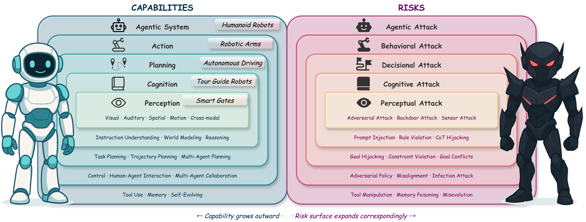
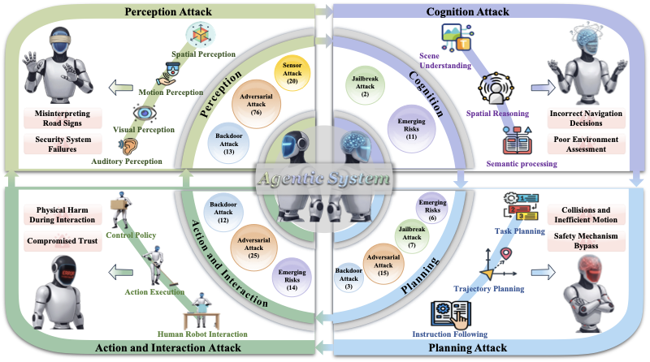
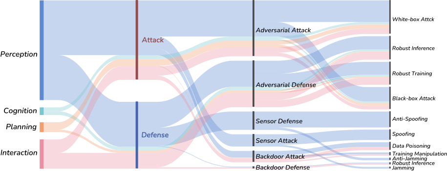

<div align="center">


# Safety in Embodied AI: A Survey of Risks, Attacks, and Defenses

[](https://github.com/x-zheng16/Awesome-Embodied-AI-Safety/blob/main/paper.pdf)
[](https://creativecommons.org/licenses/by-nc-sa/4.0/)
[](https://awesome.re)
[](#surveyed-papers)
[](https://github.com/x-zheng16/Awesome-Embodied-AI-Safety/pulls)

**A comprehensive survey and the first unified safety framework for embodied AI, covering 400+ key works across perception, cognition, planning, interaction, and agentic systems.**

[[Paper]](https://github.com/x-zheng16/Awesome-Embodied-AI-Safety/blob/main/paper.pdf)

</div>

## Authors

<div align="center">

<a href="#">Xiao Li</a><sup>1,&#42;</sup>,
<a href="#">Xiang Zheng</a><sup>3,&#42;</sup>,
<a href="#">Yifeng Gao</a><sup>1</sup>,
<a href="#">Xinyu Xia</a><sup>4</sup>,
<a href="#">Yixu Wang</a><sup>1</sup>,
<a href="#">Xin Wang</a><sup>1</sup>,
<a href="#">Ye Sun</a><sup>1</sup>,
<a href="#">Yunhan Zhao</a><sup>1</sup>,
<a href="#">Ming Wen</a><sup>1,2</sup>,
<a href="#">Jiayu Li</a><sup>1</sup>,
<a href="#">Xun Gong</a><sup>4</sup>,
<a href="#">Yi Liu</a><sup>3</sup>,
<a href="#">Yige Li</a><sup>5</sup>,
<a href="#">Yutao Wu</a><sup>6</sup>,
<a href="#">Cong Wang</a><sup>3</sup>,
<a href="#">Jun Sun</a><sup>5</sup>,
<a href="#">Yixin Cao</a><sup>1,2</sup>,
<a href="#">Zhineng Chen</a><sup>1</sup>,
<a href="#">Jingjing Chen</a><sup>1</sup>,
<a href="#">Tao Gui</a><sup>1,2</sup>,
<a href="#">Qi Zhang</a><sup>1</sup>,
<a href="#">Zuxuan Wu</a><sup>1,2</sup>,
<a href="#">Xipeng Qiu</a><sup>1,2</sup>,
<a href="#">Xuanjing Huang</a><sup>1</sup>,
<a href="#">Tiehua Zhang</a><sup>7</sup>,
<a href="#">Zhipeng Wei</a><sup>9</sup>,
<a href="#">Hanxun Huang</a><sup>10</sup>,
<a href="#">Sarah Erfani</a><sup>10</sup>,
<a href="#">James Bailey</a><sup>10</sup>,
<a href="#">Jianping Wang</a><sup>3</sup>,
<a href="#">Wei-Ying Ma</a><sup>3,11</sup>,
<a href="#">Bo Li</a><sup>8</sup>,
<a href="#">Xingjun Ma</a><sup>1,2,&dagger;</sup>,
<a href="#">Yu-Gang Jiang</a><sup>1,&dagger;</sup>

<sup>1</sup>Fudan University, <sup>2</sup>Shanghai Innovation Institute, <sup>3</sup>City University of Hong Kong, <sup>4</sup>Jilin University, <sup>5</sup>Singapore Management University, <sup>6</sup>Deakin University, <sup>7</sup>Tongji University, <sup>8</sup>UIUC, <sup>9</sup>UC Berkeley, <sup>10</sup>The University of Melbourne, <sup>11</sup>Tsinghua University

<sup>&#42;</sup>Equal Contribution, <sup>&dagger;</sup>Corresponding Authors

</div>

## Recent News

| Date       | Update                                                                                                                                                      |
| ---------- | ----------------------------------------------------------------------------------------------------------------------------------------------------------- |
| 2026/03/27 | Repository and paper released.                                                                                                                              |
| 2026/03/26 | [ISC-Bench](https://github.com/wuyoscar/ISC-Bench) paper on [arXiv](https://arxiv.org/abs/2603.23509) -- 400+ stars in 48 hours!                           |
| 2026/03/22 | [ISC-Bench](https://github.com/wuyoscar/ISC-Bench) repository released -- Internal Safety Collapse benchmark for frontier LLMs.                            |
| 2025/02/02 | [Safety at Scale](https://github.com/xingjunm/Awesome-Large-Model-Safety) survey on [arXiv](https://arxiv.org/abs/2502.05206) -- large model & agent safety. |

## Overview

Embodied AI integrates perception, cognition, planning, and interaction into agents that operate in open-world, safety-critical environments.
As these systems gain autonomy and enter domains such as autonomous driving, healthcare, and robotics, ensuring their safety becomes both technically challenging and socially indispensable.

**Capability-Risk Duality**: each layer of the embodied pipeline represents a capability expansion that introduces corresponding new vulnerabilities.

<div align="center">

<p><em>Capability vs. risk duality in embodied AI systems. As capabilities expand outward from perception to agentic systems, the attack surface grows correspondingly -- vulnerabilities at inner layers cascade to outer layers.</em></p>
</div>

<div align="center">

<p><em>Illustration of safety threats and attack surfaces across capability layers of embodied AI systems.</em></p>
</div>

<div align="center">

<p><em>Overview of representative attack and defense methods across perception, cognition, planning, action & interaction, and agentic system layers. The width of the strips is proportional to the number of reviewed works.</em></p>
</div>

## Surveyed Papers

We review **400+** papers across five capability layers of embodied AI.

| Layer | Topics | Papers |
|-------|--------|-------:|
| **Perception** | Visual Perception, Auditory Perception, Spatial Perception, Motion Perception, Cross-Modal Perception | 191 |
| **Cognition** | Instruction Understanding, World Model, Reasoning | 32 |
| **Planning** | Task Planning, Trajectory Planning, Multi-Agent Planning | 51 |
| **Action and Interaction** | Robot Control, Human-Agent Interaction, Multi-Agent Collaboration | 92 |
| **Agentic** | Tool Use, Memory, Self-Evolving, Cascading Risks | 71 |

<details open>
<summary><b>Perception</b> (191 papers)</summary>

<details>
<summary>Visual Perception (55)</summary>

- [Securing the Lane: Defences Against Patch Attacks on Autonomous Vehicle's Lane Detection](https://scholar.google.com/scholar?q=Securing+the+Lane%3A+Defences+Against+Patch+Attacks+on+Autonomous+Vehicle%27s+Lane+Detection). Blazevic et al.. *EuroS&PW*, 2025.
- [Detecting Adversarial Attacks Based on Tracking Differences in Frequency Bands](https://scholar.google.com/scholar?q=Detecting+Adversarial+Attacks+Based+on+Tracking+Differences+in+Frequency+Bands). Li, Li, Zhang. *IEEE Transactions on Multimedia (TMM)*, 2025.
- [Multi-view Feature Discrepancy Attack for Single Object Tracking](https://scholar.google.com/scholar?q=Multi-view+Feature+Discrepancy+Attack+for+Single+Object+Tracking). Li, Zhimin, Wang. *ICASSP*, 2025.
- [Towards stealthy and effective backdoor attacks on lane detection: A naturalistic data poisoning approach](https://scholar.google.com/scholar?q=Towards+stealthy+and+effective+backdoor+attacks+on+lane+detection%3A+A+naturalistic+data+poisoning+approach). Liao et al.. *arXiv 2508.15778*, 2025.
- [Stealthy Backdoor Attack in Self-Supervised Learning Vision Encoders for Large Vision Language Models](https://scholar.google.com/scholar?q=Stealthy+Backdoor+Attack+in+Self-Supervised+Learning+Vision+Encoders+for+Large+Vision+Language+Models). Liu et al.. *CVPR*, 2025.
- [PB-UAP: Hybride Universal Adversarial Attack for Image Segmentation](https://scholar.google.com/scholar?q=PB-UAP%3A+Hybride+Universal+Adversarial+Attack+for+Image+Segmentation). Song et al.. *ICASSP*, 2025.
- [BDetCLIP: Multimodal Prompting Contrastive Test-Time Backdoor Detection](https://scholar.google.com/scholar?q=BDetCLIP%3A+Multimodal+Prompting+Contrastive+Test-Time+Backdoor+Detection). Xu et al.. *ICML*, 2025.
- [AnyAttack: Towards Large-scale Self-supervised Adversarial Attacks on Vision-language Models](https://scholar.google.com/scholar?q=AnyAttack%3A+Towards+Large-scale+Self-supervised+Adversarial+Attacks+on+Vision-language+Models). Zhang et al.. *CVPR*, 2025.
- [RP-PGD: Boosting Segmentation Robustness with a Region-and-Prototype Based Adversarial Attack](https://scholar.google.com/scholar?q=RP-PGD%3A+Boosting+Segmentation+Robustness+with+a+Region-and-Prototype+Based+Adversarial+Attack). Zhang et al.. *AAAI*, 2025.
- [A Robust UAV Tracking Solution in the Adversarial Environment](https://scholar.google.com/scholar?q=A+Robust+UAV+Tracking+Solution+in+the+Adversarial+Environment). Jia, Li, Yuan. *ICTAI*, 2024.
- [BadCLIP: Dual-Embedding Guided Backdoor Attack on Multimodal Contrastive Learning](https://scholar.google.com/scholar?q=BadCLIP%3A+Dual-Embedding+Guided+Backdoor+Attack+on+Multimodal+Contrastive+Learning). Liang et al.. *CVPR*, 2024.
- [Controlloc: Physical-world hijacking attack on visual perception in autonomous driving](https://scholar.google.com/scholar?q=Controlloc%3A+Physical-world+hijacking+attack+on+visual+perception+in+autonomous+driving). Ma et al.. *arXiv 2406.05810*, 2024.
- [Uncertainty-weighted loss functions for improved adversarial attacks on semantic segmentation](https://scholar.google.com/scholar?q=Uncertainty-weighted+loss+functions+for+improved+adversarial+attacks+on+semantic+segmentation). Maag, Fischer. *WACV*, 2024.
- [Discovering new shadow patterns for black-box attacks on lane detection of autonomous vehicles](https://scholar.google.com/scholar?q=Discovering+new+shadow+patterns+for+black-box+attacks+on+lane+detection+of+autonomous+vehicles). MohajerAnsari et al.. *arXiv 2409.18248*, 2024.
- [TrackPGD: Efficient Adversarial Attack using Object Binary Masks against Robust Transformer Trackers](https://scholar.google.com/scholar?q=TrackPGD%3A+Efficient+Adversarial+Attack+using+Object+Binary+Masks+against+Robust+Transformer+Trackers). Nokabadi, Pequignot, Lalonde. *arXiv 2407.03946*, 2024.
- [Robust CLIP: Unsupervised Adversarial Fine-Tuning of Vision Embeddings for Robust Large Vision-Language Models](https://scholar.google.com/scholar?q=Robust+CLIP%3A+Unsupervised+Adversarial+Fine-Tuning+of+Vision+Embeddings+for+Robust+Large+Vision-Language+Models). Schlarmann et al.. *ICML*, 2024.
- [Embodied laser attack: leveraging scene priors to achieve agent-based robust non-contact attacks](https://scholar.google.com/scholar?q=Embodied+laser+attack%3A+leveraging+scene+priors+to+achieve+agent-based+robust+non-contact+attacks). Sun, Huang, Wei. *MM*, 2024.
- [Cascaded adversarial attack: Simultaneously fooling rain removal and semantic segmentation networks](https://scholar.google.com/scholar?q=Cascaded+adversarial+attack%3A+Simultaneously+fooling+rain+removal+and+semantic+segmentation+networks). Wang et al.. *MM*, 2024.
- [Physical ID-Transfer Attacks against Multi-Object Tracking via Adversarial Trajectory](https://scholar.google.com/scholar?q=Physical+ID-Transfer+Attacks+against+Multi-Object+Tracking+via+Adversarial+Trajectory). Wang et al.. *ACSAC*, 2024.
- [A Human-in-the-Middle Attack against Object Detection Systems](https://scholar.google.com/scholar?q=A+Human-in-the-Middle+Attack+against+Object+Detection+Systems). Wu, Rowlands, Wahlstrom. *Artificial Intelligence (AIJ)*, 2024.
- [Not All Prompts Are Secure: A Switchable Backdoor Attack Against Pre-trained Vision Transformers](https://scholar.google.com/scholar?q=Not+All+Prompts+Are+Secure%3A+A+Switchable+Backdoor+Attack+Against+Pre-trained+Vision+Transformers). Yang et al.. *CVPR*, 2024.
- [Towards robust physical-world backdoor attacks on lane detection](https://scholar.google.com/scholar?q=Towards+robust+physical-world+backdoor+attacks+on+lane+detection). Zhang et al.. *MM*, 2024.
- [CleanCLIP: Mitigating Data Poisoning Attacks in Multimodal Contrastive Learning](https://scholar.google.com/scholar?q=CleanCLIP%3A+Mitigating+Data+Poisoning+Attacks+in+Multimodal+Contrastive+Learning). Bansal et al.. *ICCV*, 2023.
- [Defending Backdoor Attacks on Vision Transformer via Patch Processing](https://scholar.google.com/scholar?q=Defending+Backdoor+Attacks+on+Vision+Transformer+via+Patch+Processing). Doan et al.. *AAAI*, 2023.
- [PSO-Based Black-Box Lane Detection Adversarial Attack](https://scholar.google.com/scholar?q=PSO-Based+Black-Box+Lane+Detection+Adversarial+Attack). Fang et al.. *AIHCIR*, 2023.
- [DECREE: Detecting Backdoors in Pre-trained Encoders](https://scholar.google.com/scholar?q=DECREE%3A+Detecting+Backdoors+in+Pre-trained+Encoders). Feng et al.. *CVPR*, 2023.
- [Detection-friendly dehazing: Object detection in real-world hazy scenes](https://scholar.google.com/scholar?q=Detection-friendly+dehazing%3A+Object+detection+in+real-world+hazy+scenes). Li et al.. *IEEE Transactions on Pattern Analysis and Machine Intelligence (TPAMI)*, 2023.
- [Wip: Towards the practicality of the adversarial attack on object tracking in autonomous driving](https://scholar.google.com/scholar?q=Wip%3A+Towards+the+practicality+of+the+adversarial+attack+on+object+tracking+in+autonomous+driving). Ma et al.. *VehicleSec*, 2023.
- [Understanding Zero-Shot Adversarial Robustness for Large-Scale Models](https://scholar.google.com/scholar?q=Understanding+Zero-Shot+Adversarial+Robustness+for+Large-Scale+Models). Mao et al.. *ICLR*, 2023.
- [Adversarial detection: Attacking object detection in real time](https://scholar.google.com/scholar?q=Adversarial+detection%3A+Attacking+object+detection+in+real+time). Wu et al.. *IV*, 2023.
- [You Are Catching My Attention: Are Vision Transformers Bad Learners under Backdoor Attacks?](https://scholar.google.com/scholar?q=You+Are+Catching+My+Attention%3A+Are+Vision+Transformers+Bad+Learners+under+Backdoor+Attacks%3F). Yuan et al.. *CVPR*, 2023.
- [TrojViT: Trojan Insertion in Vision Transformers](https://scholar.google.com/scholar?q=TrojViT%3A+Trojan+Insertion+in+Vision+Transformers). Zheng, Lou, Jiang. *CVPR*, 2023.
- [Physical backdoor attacks to lane detection systems in autonomous driving](https://scholar.google.com/scholar?q=Physical+backdoor+attacks+to+lane+detection+systems+in+autonomous+driving). Han et al.. *MM*, 2022.
- [BadEncoder: Backdoor Attacks to Pre-trained Encoders in Self-Supervised Learning](https://scholar.google.com/scholar?q=BadEncoder%3A+Backdoor+Attacks+to+Pre-trained+Encoders+in+Self-Supervised+Learning). Jia, Liu, Gong. *IEEE S&P*, 2022.
- [Image-adaptive YOLO for object detection in adverse weather conditions](https://scholar.google.com/scholar?q=Image-adaptive+YOLO+for+object+detection+in+adverse+weather+conditions). Liu et al.. *AAAI*, 2022.
- [A Perturbation-Constrained Adversarial Attack for Evaluating the Robustness of Optical Flow](https://scholar.google.com/scholar?q=A+Perturbation-Constrained+Adversarial+Attack+for+Evaluating+the+Robustness+of+Optical+Flow). Schmalfuss, Scholze, Bruhn. *ECCV*, 2022.
- [Automating defense against adversarial attacks: discovery of vulnerabilities and application of multi-INT imagery to protect deployed models](https://scholar.google.com/scholar?q=Automating+defense+against+adversarial+attacks%3A+discovery+of+vulnerabilities+and+application+of+multi-INT+imagery+to+protect+deployed+models). Kalin et al.. *Disruptive Technologies in Information Sciences V*, 2021.
- [SLAP](https://scholar.google.com/scholar?q=SLAP). Lovisotto et al.. *USENIX Security*, 2021.
- [Dirty road can attack: Security of deep learning based automated lane centering under Physical-World Attack](https://scholar.google.com/scholar?q=Dirty+road+can+attack%3A+Security+of+deep+learning+based+automated+lane+centering+under+Physical-World+Attack). Sato et al.. *USENIX Security*, 2021.
- [Model-agnostic defense for lane detection against adversarial attack](https://scholar.google.com/scholar?q=Model-agnostic+defense+for+lane+detection+against+adversarial+attack). Xu, Ju, Wagner. *arXiv 2103.00663*, 2021.
- [Sentinet: Detecting localized universal attacks against deep learning systems](https://scholar.google.com/scholar?q=Sentinet%3A+Detecting+localized+universal+attacks+against+deep+learning+systems). Chou, Tramer, Pellegrino. *SPW*, 2020.
- [DSNet: Joint semantic learning for object detection in inclement weather conditions](https://scholar.google.com/scholar?q=DSNet%3A+Joint+semantic+learning+for+object+detection+in+inclement+weather+conditions). Huang, Le, Jaw. *IEEE Transactions on Pattern Analysis and Machine Intelligence (TPAMI)*, 2020.
- [Fooling detection alone is not enough: Adversarial attack against multiple object tracking](https://scholar.google.com/scholar?q=Fooling+detection+alone+is+not+enough%3A+Adversarial+attack+against+multiple+object+tracking). Jia et al.. *ICLR*, 2020.
- [Robust tracking against adversarial attacks](https://scholar.google.com/scholar?q=Robust+tracking+against+adversarial+attacks). Jia et al.. *ECCV*, 2020.
- [Phantom of the adas: Securing advanced driver-assistance systems from split-second phantom attacks](https://scholar.google.com/scholar?q=Phantom+of+the+adas%3A+Securing+advanced+driver-assistance+systems+from+split-second+phantom+attacks). Nassi et al.. *CCS*, 2020.
- [Adversarial t-shirt! evading person detectors in a physical world](https://scholar.google.com/scholar?q=Adversarial+t-shirt%21+evading+person+detectors+in+a+physical+world). Xu et al.. *ECCV*, 2020.
- [MobilBye: attacking ADAS with camera spoofing](https://scholar.google.com/scholar?q=MobilBye%3A+attacking+ADAS+with+camera+spoofing). Nassi et al.. *arXiv 1906.09765*, 2019.
- [Fooling automated surveillance cameras: adversarial patches to attack person detection](https://scholar.google.com/scholar?q=Fooling+automated+surveillance+cameras%3A+adversarial+patches+to+attack+person+detection). Thys, Van Ranst, Goedeme. *CVPR workshops*, 2019.
- [Shapeshifter: Robust physical adversarial attack on faster r-cnn object detector](https://scholar.google.com/scholar?q=Shapeshifter%3A+Robust+physical+adversarial+attack+on+faster+r-cnn+object+detector). Chen et al.. *ECML PKDD*, 2018.
- [Robust physical-world attacks on deep learning visual classification](https://scholar.google.com/scholar?q=Robust+physical-world+attacks+on+deep+learning+visual+classification). Eykholt et al.. *CVPR*, 2018.
- [Robust camera lidar sensor fusion via deep gated information fusion network](https://scholar.google.com/scholar?q=Robust+camera+lidar+sensor+fusion+via+deep+gated+information+fusion+network). Kim et al.. *IV*, 2018.
- [Darts: Deceiving autonomous cars with toxic signs](https://scholar.google.com/scholar?q=Darts%3A+Deceiving+autonomous+cars+with+toxic+signs). Sitawarin et al.. *arXiv 1802.06430*, 2018.
- [CAMOU: Learning physical vehicle camouflages to adversarially attack detectors in the wild](https://scholar.google.com/scholar?q=CAMOU%3A+Learning+physical+vehicle+camouflages+to+adversarially+attack+detectors+in+the+wild). Zhang et al.. *ICLR*, 2018.
- [Aod-net: All-in-one dehazing network](https://scholar.google.com/scholar?q=Aod-net%3A+All-in-one+dehazing+network). Li et al.. *ICCV*, 2017.
- [Is deep learning safe for robot vision? adversarial examples against the icub humanoid](https://scholar.google.com/scholar?q=Is+deep+learning+safe+for+robot+vision%3F+adversarial+examples+against+the+icub+humanoid). Melis et al.. *ICCV*, 2017.

</details>

<details>
<summary>Auditory Perception (21)</summary>

- [Watch your speed: Injecting malicious voice commands via time-scale modification](https://scholar.google.com/scholar?q=Watch+your+speed%3A+Injecting+malicious+voice+commands+via+time-scale+modification). Ji et al.. *IEEE Transactions on Information Forensics and Security (TIFS)*, 2024.
- [Hello me, meet the real me: Audio deepfake attacks on voice assistants](https://scholar.google.com/scholar?q=Hello+me%2C+meet+the+real+me%3A+Audio+deepfake+attacks+on+voice+assistants). Bilika et al.. *arXiv 2302.10328*, 2023.
- [BarrierBypass: Out-of-sight clean voice command injection attacks through physical barriers](https://scholar.google.com/scholar?q=BarrierBypass%3A+Out-of-sight+clean+voice+command+injection+attacks+through+physical+barriers). Walker et al.. *WiSec*, 2023.
- [Defending against adversarial audio via diffusion model](https://scholar.google.com/scholar?q=Defending+against+adversarial+audio+via+diffusion+model). Wu et al.. *arXiv 2303.01507*, 2023.
- [Antifake: Using adversarial audio to prevent unauthorized speech synthesis](https://scholar.google.com/scholar?q=Antifake%3A+Using+adversarial+audio+to+prevent+unauthorized+speech+synthesis). Yu, Zhai, Zhang. *CCS*, 2023.
- [Trojanmodel: A practical trojan attack against automatic speech recognition systems](https://scholar.google.com/scholar?q=Trojanmodel%3A+A+practical+trojan+attack+against+automatic+speech+recognition+systems). Zong et al.. *S&P*, 2023.
- [Specpatch: Human-in-the-loop adversarial audio spectrogram patch attack on speech recognition](https://scholar.google.com/scholar?q=Specpatch%3A+Human-in-the-loop+adversarial+audio+spectrogram+patch+attack+on+speech+recognition). Guo et al.. *CCS*, 2022.
- [Black-box adversarial attacks on commercial speech platforms with minimal information](https://scholar.google.com/scholar?q=Black-box+adversarial+attacks+on+commercial+speech+platforms+with+minimal+information). Zheng et al.. *CCS*, 2021.
- [Devil's Whisper: A General Approach for Physical Adversarial Attacks against Commercial Black-box Speech Recognition Devices](https://scholar.google.com/scholar?q=Devil%27s+Whisper%3A+A+General+Approach+for+Physical+Adversarial+Attacks+against+Commercial+Black-box+Speech+Recognition+Devices). Chen et al.. *USENIX Security*, 2020.
- [Metamorph: Injecting inaudible commands into over-the-air voice controlled systems](https://scholar.google.com/scholar?q=Metamorph%3A+Injecting+inaudible+commands+into+over-the-air+voice+controlled+systems). Chen et al.. *NDSS*, 2020.
- [Advpulse: Universal, synchronization-free, and targeted audio adversarial attacks via subsecond perturbations](https://scholar.google.com/scholar?q=Advpulse%3A+Universal%2C+synchronization-free%2C+and+targeted+audio+adversarial+attacks+via+subsecond+perturbations). Li et al.. *CCS*, 2020.
- [Practical adversarial attacks against speaker recognition systems](https://scholar.google.com/scholar?q=Practical+adversarial+attacks+against+speaker+recognition+systems). Li et al.. *HotMobile*, 2020.
- [Adversarial example detection by classification for deep speech recognition](https://scholar.google.com/scholar?q=Adversarial+example+detection+by+classification+for+deep+speech+recognition). Samizade et al.. *ICASSP*, 2020.
- [When the differences in frequency domain are compensated: Understanding and defeating modulated replay attacks on automatic speech recognition](https://scholar.google.com/scholar?q=When+the+differences+in+frequency+domain+are+compensated%3A+Understanding+and+defeating+modulated+replay+attacks+on+automatic+speech+recognition). Wang et al.. *CCS*, 2020.
- [Practical hidden voice attacks against speech and speaker recognition systems](https://scholar.google.com/scholar?q=Practical+hidden+voice+attacks+against+speech+and+speaker+recognition+systems). Abdullah et al.. *arXiv 1904.05734*, 2019.
- [A multiversion programming inspired approach to detecting audio adversarial examples](https://scholar.google.com/scholar?q=A+multiversion+programming+inspired+approach+to+detecting+audio+adversarial+examples). Zeng et al.. *DSN*, 2019.
- [Who activated my voice assistant? A stealthy attack on android phones without users’ awareness](https://scholar.google.com/scholar?q=Who+activated+my+voice+assistant%3F+A+stealthy+attack+on+android+phones+without+users%E2%80%99+awareness). Zhang et al.. *ML4CS*, 2019.
- [Towards mitigating audio adversarial perturbations](https://scholar.google.com/scholar?q=Towards+mitigating+audio+adversarial+perturbations). Yang et al.. *arXiv 1806.02776*, 2018.
- [CommanderSong](https://scholar.google.com/scholar?q=CommanderSong). Yuan et al.. *USENIX Security*, 2018.
- [Hidden voice commands](https://scholar.google.com/scholar?q=Hidden+voice+commands). Carlini et al.. *USENIX security*, 2016.
- [Cocaine noodles: exploiting the gap between human and machine speech recognition](https://scholar.google.com/scholar?q=Cocaine+noodles%3A+exploiting+the+gap+between+human+and+machine+speech+recognition). Vaidya et al.. *WOOT*, 2015.

</details>

<details>
<summary>Spatial Perception (59)</summary>

- [Semantically safe robot manipulation: From semantic scene understanding to motion safeguards](https://scholar.google.com/scholar?q=Semantically+safe+robot+manipulation%3A+From+semantic+scene+understanding+to+motion+safeguards). Brunke et al.. *IEEE Robotics and Automation Letters (RA-L)*, 2025.
- [LiDAttack: Robust Black-Box Attack on LiDAR-Based Object Detection](https://scholar.google.com/scholar?q=LiDAttack%3A+Robust+Black-Box+Attack+on+LiDAR-Based+Object+Detection). Chen et al.. *ITSC*, 2025.
- [Splat-nav: Safe real-time robot navigation in gaussian splatting maps](https://scholar.google.com/scholar?q=Splat-nav%3A+Safe+real-time+robot+navigation+in+gaussian+splatting+maps). Chen et al.. *IEEE Transactions on Robotics (T-RO)*, 2025.
- [Black-box explainability-guided adversarial attack for 3D object tracking](https://scholar.google.com/scholar?q=Black-box+explainability-guided+adversarial+attack+for+3D+object+tracking). Cheng et al.. *IEEE Transactions on Circuits and Systems for Video Technology (TCSVT)*, 2025.
- [Lidar light scattering augmentation (lisa): Physics-based simulation of adverse weather conditions for 3d object detection](https://scholar.google.com/scholar?q=Lidar+light+scattering+augmentation+%28lisa%29%3A+Physics-based+simulation+of+adverse+weather+conditions+for+3d+object+detection). Kilic et al.. *ICASSP*, 2025.
- [Invisible but Detected: Physical Adversarial Shadow Attack and Defense on LiDAR-based 3D Object Detection](https://scholar.google.com/scholar?q=Invisible+but+Detected%3A+Physical+Adversarial+Shadow+Attack+and+Defense+on+LiDAR-based+3D+Object+Detection). Kobayashi et al.. *USENIX Security*, 2025.
- [Enhancing the Robustness of LiDAR-based Object Detection under Disappearing Attacks](https://scholar.google.com/scholar?q=Enhancing+the+Robustness+of+LiDAR-based+Object+Detection+under+Disappearing+Attacks). Wang et al.. *ICASSP*, 2025.
- [An imperceptible adversarial attack against 3d object detectors in autonomous driving](https://scholar.google.com/scholar?q=An+imperceptible+adversarial+attack+against+3d+object+detectors+in+autonomous+driving). Wang et al.. *IEEE Internet of Things Journal (IoT-J)*, 2025.
- [Towards Real-Time Defense against Object-Based LiDAR Attacks in Autonomous Driving](https://scholar.google.com/scholar?q=Towards+Real-Time+Defense+against+Object-Based+LiDAR+Attacks+in+Autonomous+Driving). Zhang et al.. *CCS*, 2025.
- [A New Adversarial Perspective for LiDAR-based 3D Object Detection](https://scholar.google.com/scholar?q=A+New+Adversarial+Perspective+for+LiDAR-based+3D+Object+Detection). Zheng et al.. *AAAI*, 2025.
- [Diffusion models-based purification for common corruptions on robust 3D object detection](https://scholar.google.com/scholar?q=Diffusion+models-based+purification+for+common+corruptions+on+robust+3D+object+detection). Cai et al.. *Sensors*, 2024.
- [Adversary is on the Road: Attacks on Visual SLAM with Robust Perturbations on Point Clouds](https://scholar.google.com/scholar?q=Adversary+is+on+the+Road%3A+Attacks+on+Visual+SLAM+with+Robust+Perturbations+on+Point+Clouds). Chen et al.. *USENIX Security*, 2024.
- [Catnips: Collision avoidance through neural implicit probabilistic scenes](https://scholar.google.com/scholar?q=Catnips%3A+Collision+avoidance+through+neural+implicit+probabilistic+scenes). Chen, Culbertson, Schwager. *IEEE Transactions on Robotics (T-RO)*, 2024.
- [Safer-splat: A control barrier function for safe navigation with online gaussian splatting maps](https://scholar.google.com/scholar?q=Safer-splat%3A+A+control+barrier+function+for+safe+navigation+with+online+gaussian+splatting+maps). Chen et al.. *arXiv 2409.09868*, 2024.
- [Random Spoofing Attack against LiDAR-Based Scan Matching SLAM](https://scholar.google.com/scholar?q=Random+Spoofing+Attack+against+LiDAR-Based+Scan+Matching+SLAM). Fukunaga, Sugawara. *VehicleSec*, 2024.
- [SpotAttack: Covering Spots on Surface to Attack LiDAR Based Autonomous Driving Systems](https://scholar.google.com/scholar?q=SpotAttack%3A+Covering+Spots+on+Surface+to+Attack+LiDAR+Based+Autonomous+Driving+Systems). Huang et al.. *IEEE Internet of Things Journal (IoT-J)*, 2024.
- [Adv3D: Generating 3D adversarial examples for 3D object detection in driving scenarios with NeRF](https://scholar.google.com/scholar?q=Adv3D%3A+Generating+3D+adversarial+examples+for+3D+object+detection+in+driving+scenarios+with+NeRF). Li, Lian, Chen. *IROS*, 2024.
- [Beyond uncertainty: Risk-aware active view acquisition for safe robot navigation and 3d scene understanding with fisherrf](https://scholar.google.com/scholar?q=Beyond+uncertainty%3A+Risk-aware+active+view+acquisition+for+safe+robot+navigation+and+3d+scene+understanding+with+fisherrf). Liu et al.. *arXiv 2403.11396*, 2024.
- [A First Physical-World Trajectory Prediction Attack via LiDAR-induced Deceptions in Autonomous Driving](https://scholar.google.com/scholar?q=A+First+Physical-World+Trajectory+Prediction+Attack+via+LiDAR-induced+Deceptions+in+Autonomous+Driving). Lou et al.. *USENIX Security Symposium*, 2024.
- [Poison-splat: Computation cost attack on 3d gaussian splatting](https://scholar.google.com/scholar?q=Poison-splat%3A+Computation+cost+attack+on+3d+gaussian+splatting). Lu et al.. *arXiv 2410.08190*, 2024.
- [Evaluating the Robustness of LiDAR Point Cloud Tracking Against Adversarial Attack](https://scholar.google.com/scholar?q=Evaluating+the+Robustness+of+LiDAR+Point+Cloud+Tracking+Against+Adversarial+Attack). Tian et al.. *arXiv 2410.20893*, 2024.
- [Benchmarking robustness in neural radiance fields](https://scholar.google.com/scholar?q=Benchmarking+robustness+in+neural+radiance+fields). Wang et al.. *CVPR*, 2024.
- [Mobile Cooperative Robot Safe Interaction Method Based on Embodied Perception](https://scholar.google.com/scholar?q=Mobile+Cooperative+Robot+Safe+Interaction+Method+Based+on+Embodied+Perception). Wang et al.. *ICCA*, 2024.
- [A comprehensive study of the robustness for lidar-based 3d object detectors against adversarial attacks](https://scholar.google.com/scholar?q=A+comprehensive+study+of+the+robustness+for+lidar-based+3d+object+detectors+against+adversarial+attacks). Zhang, Hou, Yuan. *International Journal of Computer Vision (IJCV)*, 2024.
- [Control-barrier-aided teleoperation with visual-inertial slam for safe mav navigation in complex environments](https://scholar.google.com/scholar?q=Control-barrier-aided+teleoperation+with+visual-inertial+slam+for+safe+mav+navigation+in+complex+environments). Zhou et al.. *ICRA*, 2024.
- [AE-Morpher](https://scholar.google.com/scholar?q=AE-Morpher). Zhu et al.. *USENIX Security*, 2024.
- [Adopt: Lidar spoofing attack detection based on point-level temporal consistency](https://scholar.google.com/scholar?q=Adopt%3A+Lidar+spoofing+attack+detection+based+on+point-level+temporal+consistency). Cho et al.. *arXiv 2310.14504*, 2023.
- [Targeted adversarial attacks on generalizable neural radiance fields](https://scholar.google.com/scholar?q=Targeted+adversarial+attacks+on+generalizable+neural+radiance+fields). Horvath. *CVPR*, 2023.
- [Badlidet: A simple backdoor attack against lidar object detection in autonomous driving](https://scholar.google.com/scholar?q=Badlidet%3A+A+simple+backdoor+attack+against+lidar+object+detection+in+autonomous+driving). Li et al.. *TrustCom*, 2023.
- [Towards dynamic backdoor attacks against lidar semantic segmentation in autonomous driving](https://scholar.google.com/scholar?q=Towards+dynamic+backdoor+attacks+against+lidar+semantic+segmentation+in+autonomous+driving). Li, Wen, Cheng. *TrustCom*, 2023.
- [Slowlidar: Increasing the latency of lidar-based detection using adversarial examples](https://scholar.google.com/scholar?q=Slowlidar%3A+Increasing+the+latency+of+lidar-based+detection+using+adversarial+examples). Liu et al.. *CVPR*, 2023.
- [Transferable adversarial attack on 3D object tracking in point cloud](https://scholar.google.com/scholar?q=Transferable+adversarial+attack+on+3D+object+tracking+in+point+cloud). Liu et al.. *MMM*, 2023.
- [Scene augmentation methods for interactive embodied AI tasks](https://scholar.google.com/scholar?q=Scene+augmentation+methods+for+interactive+embodied+AI+tasks). Sang et al.. *IEEE Transactions on Instrumentation and Measurement*, 2023.
- [Exorcising ``Wraith'': Protecting LiDAR-based Object Detector in Automated Driving System from Appearing Attacks](https://scholar.google.com/scholar?q=Exorcising+%60%60Wraith%27%27%3A+Protecting+LiDAR-based+Object+Detector+in+Automated+Driving+System+from+Appearing+Attacks). Xiao et al.. *USENIX Security*, 2023.
- [Vision-only robot navigation in a neural radiance world](https://scholar.google.com/scholar?q=Vision-only+robot+navigation+in+a+neural+radiance+world). Adamkiewicz et al.. *IEEE Robotics and Automation Letters (RA-L)*, 2022.
- [Adversarial attacks on monocular pose estimation](https://scholar.google.com/scholar?q=Adversarial+attacks+on+monocular+pose+estimation). Chawla et al.. *IROS*, 2022.
- [Physical attack on monocular depth estimation with optimal adversarial patches](https://scholar.google.com/scholar?q=Physical+attack+on+monocular+depth+estimation+with+optimal+adversarial+patches). Cheng et al.. *ECCV*, 2022.
- [Viewfool: Evaluating the robustness of visual recognition to adversarial viewpoints](https://scholar.google.com/scholar?q=Viewfool%3A+Evaluating+the+robustness+of+visual+recognition+to+adversarial+viewpoints). Dong et al.. *NeurIPS*, 2022.
- [Perceptual aliasing++: Adversarial attack for visual slam front-end and back-end](https://scholar.google.com/scholar?q=Perceptual+aliasing%2B%2B%3A+Adversarial+attack+for+visual+slam+front-end+and+back-end). Ikram et al.. *IEEE Robotics and Automation Letters (RA-L)*, 2022.
- [3d-vfield: Adversarial augmentation of point clouds for domain generalization in 3d object detection](https://scholar.google.com/scholar?q=3d-vfield%3A+Adversarial+augmentation+of+point+clouds+for+domain+generalization+in+3d+object+detection). Lehner et al.. *CVPR*, 2022.
- [Enforcing safety for vision-based controllers via control barrier functions and neural radiance fields](https://scholar.google.com/scholar?q=Enforcing+safety+for+vision-based+controllers+via+control+barrier+functions+and+neural+radiance+fields). Tong, Dawson, Fan. *arXiv 2209.12266*, 2022.
- [Adversarial scan attack against scan matching algorithm for pose estimation in lidar-based slam](https://scholar.google.com/scholar?q=Adversarial+scan+attack+against+scan+matching+algorithm+for+pose+estimation+in+lidar-based+slam). Yoshida, Hojo, Fujino. *Science*, 2022.
- [Pointcutmix: Regularization strategy for point cloud classification](https://scholar.google.com/scholar?q=Pointcutmix%3A+Regularization+strategy+for+point+cloud+classification). Zhang et al.. *Neurocomputing*, 2022.
- [Towards backdoor attacks against lidar object detection in autonomous driving](https://scholar.google.com/scholar?q=Towards+backdoor+attacks+against+lidar+object+detection+in+autonomous+driving). Zhang et al.. *SenSys*, 2022.
- [DoubleStar](https://scholar.google.com/scholar?q=DoubleStar). Zhou et al.. *USENIX Security*, 2022.
- [Universal adversarial attack against 3D object tracking](https://scholar.google.com/scholar?q=Universal+adversarial+attack+against+3D+object+tracking). Cheng et al.. *HPCC*, 2021.
- [Fog simulation on real LiDAR point clouds for 3D object detection in adverse weather](https://scholar.google.com/scholar?q=Fog+simulation+on+real+LiDAR+point+clouds+for+3D+object+detection+in+adverse+weather). Hahner et al.. *CVPR*, 2021.
- [Object removal attacks on lidar-based 3d object detectors](https://scholar.google.com/scholar?q=Object+removal+attacks+on+lidar-based+3d+object+detectors). Hau et al.. *arXiv 2102.03722*, 2021.
- [Shadow-catcher: Looking into shadows to detect ghost objects in autonomous vehicle 3d sensing](https://scholar.google.com/scholar?q=Shadow-catcher%3A+Looking+into+shadows+to+detect+ghost+objects+in+autonomous+vehicle+3d+sensing). Hau et al.. *ESORICS*, 2021.
- [Fooling lidar perception via adversarial trajectory perturbation](https://scholar.google.com/scholar?q=Fooling+lidar+perception+via+adversarial+trajectory+perturbation). Li et al.. *CVPR*, 2021.
- [Pointguard: Provably robust 3d point cloud classification](https://scholar.google.com/scholar?q=Pointguard%3A+Provably+robust+3d+point+cloud+classification). Liu, Jia, Gong. *CVPR*, 2021.
- [Adversarially robust 3d point cloud recognition using self-supervisions](https://scholar.google.com/scholar?q=Adversarially+robust+3d+point+cloud+recognition+using+self-supervisions). Sun et al.. *NeurIPS*, 2021.
- [I can see the light: Attacks on autonomous vehicles using invisible lights](https://scholar.google.com/scholar?q=I+can+see+the+light%3A+Attacks+on+autonomous+vehicles+using+invisible+lights). Wang et al.. *CCS*, 2021.
- [Temporal consistency checks to detect lidar spoofing attacks on autonomous vehicle perception](https://scholar.google.com/scholar?q=Temporal+consistency+checks+to+detect+lidar+spoofing+attacks+on+autonomous+vehicle+perception). You, Hau, Demetriou. *Workshop on Security and Privacy for Mobile AI*, 2021.
- [AcousticFusion: Fusing sound source localization to visual SLAM in dynamic environments](https://scholar.google.com/scholar?q=AcousticFusion%3A+Fusing+sound+source+localization+to+visual+SLAM+in+dynamic+environments). Zhang et al.. *IROS*, 2021.
- [Cnn-based lidar point cloud de-noising in adverse weather](https://scholar.google.com/scholar?q=Cnn-based+lidar+point+cloud+de-noising+in+adverse+weather). Heinzler et al.. *IEEE Robotics and Automation Letters (RA-L)*, 2020.
- [Physically realizable adversarial examples for lidar object detection](https://scholar.google.com/scholar?q=Physically+realizable+adversarial+examples+for+lidar+object+detection). Tu et al.. *CVPR*, 2020.
- [Adversarial objects against lidar-based autonomous driving systems](https://scholar.google.com/scholar?q=Adversarial+objects+against+lidar-based+autonomous+driving+systems). Cao et al.. *arXiv 1907.05418*, 2019.
- [Defense-pointnet: Protecting pointnet against adversarial attacks](https://scholar.google.com/scholar?q=Defense-pointnet%3A+Protecting+pointnet+against+adversarial+attacks). Zhang et al.. *Big Data*, 2019.

</details>

<details>
<summary>Motion Perception (48)</summary>

- [Safety Interventions against Adversarial Patches in an Open-Source Driver Assistance System](https://scholar.google.com/scholar?q=Safety+Interventions+against+Adversarial+Patches+in+an+Open-Source+Driver+Assistance+System). Chen et al.. *DSN*, 2025.
- [Attacking mmWave Imaging with Neural Meta-Material Rendering](https://scholar.google.com/scholar?q=Attacking+mmWave+Imaging+with+Neural+Meta-Material+Rendering). Geng et al.. *IEEE Transactions on Information Forensics and Security (TIFS)*, 2025.
- [A Spoofing Detection and Direction-Finding Approach for Global Navigation Satellite System Signals Using Off-the-Shelf Anti-Jamming Antennas](https://scholar.google.com/scholar?q=A+Spoofing+Detection+and+Direction-Finding+Approach+for+Global+Navigation+Satellite+System+Signals+Using+Off-the-Shelf+Anti-Jamming+Antennas). Jin et al.. *Remote Sensing*, 2025.
- [GNSS Spoofing Detection Based on Opportunistic Position Information](https://scholar.google.com/scholar?q=GNSS+Spoofing+Detection+Based+on+Opportunistic+Position+Information). Liu, Papadimitratos. *arXiv 2506.12580*, 2025.
- [SecureTrack: Protecting Vehicular Sensors from Non-Invasive EMI Attacks](https://scholar.google.com/scholar?q=SecureTrack%3A+Protecting+Vehicular+Sensors+from+Non-Invasive+EMI+Attacks). Singh, Mishra. *IEEE Sensors Journal*, 2025.
- [GNSS jammer localization and identification with airborne commercial GNSS receivers](https://scholar.google.com/scholar?q=GNSS+jammer+localization+and+identification+with+airborne+commercial+GNSS+receivers). Spanghero et al.. *IEEE Transactions on Information Forensics and Security (TIFS)*, 2025.
- [Practical Spoofing Attacks on Galileo Open Service Navigation Message Authentication](https://scholar.google.com/scholar?q=Practical+Spoofing+Attacks+on+Galileo+Open+Service+Navigation+Message+Authentication). Wang et al.. *arXiv 2501.09246*, 2025.
- [Analysis and Validation of Distributed GNSS Spoofing Threat](https://scholar.google.com/scholar?q=Analysis+and+Validation+of+Distributed+GNSS+Spoofing+Threat). Zhong, Li, Lu. *Engineering Proceedings*, 2025.
- [Unveiling the stealthy threat: Analyzing slow drift gps spoofing attacks for autonomous vehicles in urban environments and enabling the resilience](https://scholar.google.com/scholar?q=Unveiling+the+stealthy+threat%3A+Analyzing+slow+drift+gps+spoofing+attacks+for+autonomous+vehicles+in+urban+environments+and+enabling+the+resilience). Dasgupta et al.. *arXiv 2401.01394*, 2024.
- [A deep learning based induced GNSS spoof detection framework](https://scholar.google.com/scholar?q=A+deep+learning+based+induced+GNSS+spoof+detection+framework). Iqbal, Aman, Sikdar. *Machine Learning (MLJ)*, 2024.
- [Acoustic Attack Mitigation Approach for MEMS Inertial Sensors Using Change Point Detection on MhIMU Framework](https://scholar.google.com/scholar?q=Acoustic+Attack+Mitigation+Approach+for+MEMS+Inertial+Sensors+Using+Change+Point+Detection+on+MhIMU+Framework). Sahu, Poddar. *IEEE Transactions on Aerospace and Electronic Systems*, 2024.
- [VIMU: Effective Physics-based Realtime Detection and Recovery against Stealthy Attacks on UAVs](https://scholar.google.com/scholar?q=VIMU%3A+Effective+Physics-based+Realtime+Detection+and+Recovery+against+Stealthy+Attacks+on+UAVs). Wang et al.. *ACSAC*, 2024.
- [Metawave: Attacking mmwave sensing with meta-material-enhanced tags](https://scholar.google.com/scholar?q=Metawave%3A+Attacking+mmwave+sensing+with+meta-material-enhanced+tags). Chen et al.. *NDSS*, 2023.
- [Exploring practical acoustic transduction attacks on inertial sensors in MDOF systems](https://scholar.google.com/scholar?q=Exploring+practical+acoustic+transduction+attacks+on+inertial+sensors+in+MDOF+systems). Gao et al.. *IEEE Transactions on Mobile Computing*, 2023.
- [Paralyzing Drones via EMI Signal Injection on Sensory Communication Channels](https://scholar.google.com/scholar?q=Paralyzing+Drones+via+EMI+Signal+Injection+on+Sensory+Communication+Channels). Jang et al.. *NDSS*, 2023.
- [Un-Rocking Drones: Foundations of Acoustic Injection Attacks and Recovery Thereof](https://scholar.google.com/scholar?q=Un-Rocking+Drones%3A+Foundations+of+Acoustic+Injection+Attacks+and+Recovery+Thereof). Jeong et al.. *NDSS*, 2023.
- [mmspoof: Resilient spoofing of automotive millimeter-wave radars using reflect array](https://scholar.google.com/scholar?q=mmspoof%3A+Resilient+spoofing+of+automotive+millimeter-wave+radars+using+reflect+array). Vennam et al.. *S&P*, 2023.
- [Anti-spoofing technique based on vector tracking loop](https://scholar.google.com/scholar?q=Anti-spoofing+technique+based+on+vector+tracking+loop). Zhou et al.. *IEEE Transactions on Instrumentation and Measurement*, 2023.
- [TileMask: A passive-reflection-based attack against mmWave radar object detection in autonomous driving](https://scholar.google.com/scholar?q=TileMask%3A+A+passive-reflection-based+attack+against+mmWave+radar+object+detection+in+autonomous+driving). Zhu et al.. *CCS*, 2023.
- [ESP spoofing: Covert acoustic attack on MEMS gyroscopes in vehicles](https://scholar.google.com/scholar?q=ESP+spoofing%3A+Covert+acoustic+attack+on+MEMS+gyroscopes+in+vehicles). Hong et al.. *IEEE Transactions on Information Forensics and Security (TIFS)*, 2022.
- [Combating single-frequency jamming through a multi-frequency, multi-constellation software receiver: a case study for maritime navigation in the Gulf of Finland](https://scholar.google.com/scholar?q=Combating+single-frequency+jamming+through+a+multi-frequency%2C+multi-constellation+software+receiver%3A+a+case+study+for+maritime+navigation+in+the+Gulf+of+Finland). Islam et al.. *Sensors*, 2022.
- [DeepPOSE: Detecting GPS spoofing attack via deep recurrent neural network](https://scholar.google.com/scholar?q=DeepPOSE%3A+Detecting+GPS+spoofing+attack+via+deep+recurrent+neural+network). Jiang, Wu, Xin. *Digital Communications and Networks*, 2022.
- [A traceability localization method of acoustic attack source for mems gyroscope](https://scholar.google.com/scholar?q=A+traceability+localization+method+of+acoustic+attack+source+for+mems+gyroscope). Liu, Hong, Chen. *IEEE Embedded Systems Letters*, 2022.
- [Spoofing attacks against vehicular FMCW radar](https://scholar.google.com/scholar?q=Spoofing+attacks+against+vehicular+FMCW+radar). Komissarov, Wool. *Workshop on Attacks and Solutions in Hardware Security*, 2021.
- [Relay/replay attacks on GNSS signals](https://scholar.google.com/scholar?q=Relay%2Freplay+attacks+on+GNSS+signals). Lenhart, Spanghero, Papadimitratos. *WiSec*, 2021.
- [SoundFence: Securing ultrasonic sensors in vehicles using physical-layer defense](https://scholar.google.com/scholar?q=SoundFence%3A+Securing+ultrasonic+sensors+in+vehicles+using+physical-layer+defense). Lou et al.. *SECON*, 2021.
- [A frequency-domain spoofing attack on FMCW radars and its mitigation technique based on a hybrid-chirp waveform](https://scholar.google.com/scholar?q=A+frequency-domain+spoofing+attack+on+FMCW+radars+and+its+mitigation+technique+based+on+a+hybrid-chirp+waveform). Nallabolu, Li. *IEEE Transactions on Microwave Theory and Techniques (TMTT)*, 2021.
- [Who is in control? practical physical layer attack and defense for mmwave-based sensing in autonomous vehicles](https://scholar.google.com/scholar?q=Who+is+in+control%3F+practical+physical+layer+attack+and+defense+for+mmwave-based+sensing+in+autonomous+vehicles). Sun et al.. *IEEE Transactions on Information Forensics and Security (TIFS)*, 2021.
- [GNSS jamming classification via CNN, transfer learning & the novel concatenation of signal representations](https://scholar.google.com/scholar?q=GNSS+jamming+classification+via+CNN%2C+transfer+learning+%26+the+novel+concatenation+of+signal+representations). Swinney, Woods. *CyberSA*, 2021.
- [Machine learning-based approach to GPS antijamming](https://scholar.google.com/scholar?q=Machine+learning-based+approach+to+GPS+antijamming). Wang et al.. *GPS Solutions*, 2021.
- [Spoofing attack on ultrasonic distance sensors using a continuous signal](https://scholar.google.com/scholar?q=Spoofing+attack+on+ultrasonic+distance+sensors+using+a+continuous+signal). Gluck et al.. *Sensors*, 2020.
- [Drift with Devil: Security of Multi-Sensor Fusion based Localization in Autonomous Driving under GPS Spoofing](https://scholar.google.com/scholar?q=Drift+with+Devil%3A+Security+of+Multi-Sensor+Fusion+based+Localization+in+Autonomous+Driving+under+GPS+Spoofing). Shen et al.. *USENIX Security*, 2020.
- [Sensor defense in-software (SDI): Practical software based detection of spoofing attacks on position sensors](https://scholar.google.com/scholar?q=Sensor+defense+in-software+%28SDI%29%3A+Practical+software+based+detection+of+spoofing+attacks+on+position+sensors). Tharayil et al.. *Artificial Intelligence (AIJ)*, 2020.
- [Deepsim: Gps spoofing detection on uavs using satellite imagery matching](https://scholar.google.com/scholar?q=Deepsim%3A+Gps+spoofing+detection+on+uavs+using+satellite+imagery+matching). Xue et al.. *ACSAC*, 2020.
- [VANET-assisted interference mitigation for millimeter-wave automotive radar sensors](https://scholar.google.com/scholar?q=VANET-assisted+interference+mitigation+for+millimeter-wave+automotive+radar+sensors). Zhang et al.. *IEEE Network*, 2020.
- [Drones in distress: A game-theoretic countermeasure for protecting UAVs against GPS spoofing](https://scholar.google.com/scholar?q=Drones+in+distress%3A+A+game-theoretic+countermeasure+for+protecting+UAVs+against+GPS+spoofing). Eldosouky, Ferdowsi, Saad. *IEEE Internet of Things Journal (IoT-J)*, 2019.
- [A dual antenna GNSS spoofing detector based on the dispersion of double difference measurements](https://scholar.google.com/scholar?q=A+dual+antenna+GNSS+spoofing+detector+based+on+the+dispersion+of+double+difference+measurements). Falco et al.. *NAVITEC*, 2018.
- [Development of a GPS spoofing apparatus to attack a DJI Matrice 100 Quadcopter](https://scholar.google.com/scholar?q=Development+of+a+GPS+spoofing+apparatus+to+attack+a+DJI+Matrice+100+Quadcopter). Horton, Ranganathan. *The Journal of Global Positioning Systems*, 2018.
- [Crowd-GPS-Sec: Leveraging crowdsourcing to detect and localize GPS spoofing attacks](https://scholar.google.com/scholar?q=Crowd-GPS-Sec%3A+Leveraging+crowdsourcing+to+detect+and+localize+GPS+spoofing+attacks). Jansen et al.. *S&P*, 2018.
- [Autonomous vehicle ultrasonic sensor vulnerability and impact assessment](https://scholar.google.com/scholar?q=Autonomous+vehicle+ultrasonic+sensor+vulnerability+and+impact+assessment). Lim, Keoh, Thing. *WF-IoT*, 2018.
- [Analyzing and enhancing the security of ultrasonic sensors for autonomous vehicles](https://scholar.google.com/scholar?q=Analyzing+and+enhancing+the+security+of+ultrasonic+sensors+for+autonomous+vehicles). Xu et al.. *IEEE Internet of Things Journal (IoT-J)*, 2018.
- [Chips-message robust authentication (Chimera) for GPS civilian signals](https://scholar.google.com/scholar?q=Chips-message+robust+authentication+%28Chimera%29+for+GPS+civilian+signals). Anderson et al.. *GNSS+*, 2017.
- [WALNUT: Waging doubt on the integrity of MEMS accelerometers with acoustic injection attacks](https://scholar.google.com/scholar?q=WALNUT%3A+Waging+doubt+on+the+integrity+of+MEMS+accelerometers+with+acoustic+injection+attacks). Trippel et al.. *EuroS&P*, 2017.
- [GNSS spoofing detection and mitigation based on maximum likelihood estimation](https://scholar.google.com/scholar?q=GNSS+spoofing+detection+and+mitigation+based+on+maximum+likelihood+estimation). Wang, Li, Lu. *Sensors*, 2017.
- [A navigation message authentication proposal for the Galileo open service](https://scholar.google.com/scholar?q=A+navigation+message+authentication+proposal+for+the+Galileo+open+service). Fernandez-Hernandez, Rijmen, Seco-Granados. *NAVIGATION: Journal of the Institute of Navigation*, 2016.
- [Can you trust autonomous vehicles: Contactless attacks against sensors of self-driving vehicle](https://scholar.google.com/scholar?q=Can+you+trust+autonomous+vehicles%3A+Contactless+attacks+against+sensors+of+self-driving+vehicle). Yan, Xu, Liu. *DEF CON*, 2016.
- [Rocking drones with intentional sound noise on gyroscopic sensors](https://scholar.google.com/scholar?q=Rocking+drones+with+intentional+sound+noise+on+gyroscopic+sensors). Son et al.. *USENIX Security*, 2015.
- [Anti-spoofing and open GNSS signal authentication with signal authentication sequences](https://scholar.google.com/scholar?q=Anti-spoofing+and+open+GNSS+signal+authentication+with+signal+authentication+sequences). Pozzobon et al.. *NAVITEC*, 2010.

</details>

<details>
<summary>Cross-Modal Perception (8)</summary>

- [Temporal Misalignment Attacks against Multimodal Perception in Autonomous Driving](https://scholar.google.com/scholar?q=Temporal+Misalignment+Attacks+against+Multimodal+Perception+in+Autonomous+Driving). Hou et al.. *arXiv 2507.09095*, 2025.
- [Malicious Attacks against Multi-Sensor Fusion in Autonomous Driving](https://scholar.google.com/scholar?q=Malicious+Attacks+against+Multi-Sensor+Fusion+in+Autonomous+Driving). Li et al.. *Proceedings of the ACM International Conference on Mobile Computing and Networking (MobiCom)*, 2024.
- [MMCert](https://scholar.google.com/scholar?q=MMCert). Wang et al.. *CVPR*, 2024.
- [A robust multi-sensor fusion model against adversarial patch attack](https://scholar.google.com/scholar?q=A+robust+multi-sensor+fusion+model+against+adversarial+patch+attack). Yang et al.. *ResearchGate preprint*, 2024.
- [Exploring Adversarial Robustness of LiDAR](https://scholar.google.com/scholar?q=Exploring+Adversarial+Robustness+of+LiDAR). Li et al.. *CVPR*, 2023.
- [Security Analysis of Camera-LiDAR](https://scholar.google.com/scholar?q=Security+Analysis+of+Camera-LiDAR). Hallyburton et al.. *USENIX Security*, 2022.
- [Adversarial Robustness of Deep Sensor Fusion Models](https://scholar.google.com/scholar?q=Adversarial+Robustness+of+Deep+Sensor+Fusion+Models). Wang et al.. *WACV*, 2022.
- [Invisible for both Camera and LiDAR](https://scholar.google.com/scholar?q=Invisible+for+both+Camera+and+LiDAR). Cao et al.. *S&P*, 2021.

</details>

</details>

<details open>
<summary><b>Cognition</b> (32 papers)</summary>

<details>
<summary>Instruction Understanding (12)</summary>

- [Safe LLM-Controlled Robots with Formal Guarantees via Reachability Analysis](https://scholar.google.com/scholar?q=Safe+LLM-Controlled+Robots+with+Formal+Guarantees+via+Reachability+Analysis). Abuduweili et al.. *arXiv 2503.03911*, 2025.
- [BadNAVer: Exploring Jailbreak Attacks On Vision-and-Language Navigation](https://scholar.google.com/scholar?q=BadNAVer%3A+Exploring+Jailbreak+Attacks+On+Vision-and-Language+Navigation). Bai et al.. *arXiv 2505.12443*, 2025.
- [AGENTSAFE: Benchmarking the Safety of Embodied Agents on Hazardous Instructions](https://scholar.google.com/scholar?q=AGENTSAFE%3A+Benchmarking+the+Safety+of+Embodied+Agents+on+Hazardous+Instructions). Liu et al.. *arXiv 2506.14697*, 2025.
- [Embodied Scene Understanding for Vision Language Models via MetaVQA](https://scholar.google.com/scholar?q=Embodied+Scene+Understanding+for+Vision+Language+Models+via+MetaVQA). Wang et al.. *CVPR*, 2025.
- [RoboSafe: Safeguarding Embodied Agents via Executable Safety Logic](https://scholar.google.com/scholar?q=RoboSafe%3A+Safeguarding+Embodied+Agents+via+Executable+Safety+Logic). Wang et al.. *arXiv 2512.21220*, 2025.
- [Preventing Robotic Jailbreaking via Multimodal Domain Adaptation](https://scholar.google.com/scholar?q=Preventing+Robotic+Jailbreaking+via+Multimodal+Domain+Adaptation). Wu et al.. *arXiv 2509.23281*, 2025.
- [EmbodiedBench: Comprehensive Benchmarking Multi-modal Large Language Models for Vision-Driven Embodied Agents](https://scholar.google.com/scholar?q=EmbodiedBench%3A+Comprehensive+Benchmarking+Multi-modal+Large+Language+Models+for+Vision-Driven+Embodied+Agents). Yang et al.. *arXiv preprint*, 2025.
- [CHAI: Command Hijacking against Embodied AI](https://scholar.google.com/scholar?q=CHAI%3A+Command+Hijacking+against+Embodied+AI). Burbano, Ortiz, Sun. *arXiv 2510.00181*, 2024.
- [Can we trust embodied agents? exploring backdoor attacks against embodied LLM-based decision-making systems](https://scholar.google.com/scholar?q=Can+we+trust+embodied+agents%3F+exploring+backdoor+attacks+against+embodied+LLM-based+decision-making+systems). Jiao et al.. *arXiv 2405.20774*, 2024.
- [IndustryEQA: Pushing the Frontiers of Embodied Question Answering in Industrial Scenarios](https://scholar.google.com/scholar?q=IndustryEQA%3A+Pushing+the+Frontiers+of+Embodied+Question+Answering+in+Industrial+Scenarios). Li et al.. *arXiv preprint*, 2024.
- [Mmro: Are multimodal llms eligible as the brain for in-home robotics?](https://scholar.google.com/scholar?q=Mmro%3A+Are+multimodal+llms+eligible+as+the+brain+for+in-home+robotics%3F). Li et al.. *arXiv 2406.19693*, 2024.
- [SQA3D](https://scholar.google.com/scholar?q=SQA3D). Yong et al.. *ICLR*, 2023.

</details>

<details>
<summary>World Model (10)</summary>

- [The Safety Challenge of World Models for Embodied AI Agents: A Review](https://scholar.google.com/scholar?q=The+Safety+Challenge+of+World+Models+for+Embodied+AI+Agents%3A+A+Review). Baraldi et al.. *arXiv 2510.05865*, 2025.
- [MASH-VLM](https://scholar.google.com/scholar?q=MASH-VLM). Hou et al.. *CVPR*, 2025.
- [A Comprehensive Survey on World Models for Embodied AI](https://scholar.google.com/scholar?q=A+Comprehensive+Survey+on+World+Models+for+Embodied+AI). Li et al.. *arXiv 2510.16732*, 2025.
- [VL-SAFE: Vision-Language Guided Safety-Aware RL with World Models for Autonomous Driving](https://scholar.google.com/scholar?q=VL-SAFE%3A+Vision-Language+Guided+Safety-Aware+RL+with+World+Models+for+Autonomous+Driving). Qu et al.. *arXiv preprint*, 2025.
- [An Empirical Study on Hallucinations in Embodied Agents](https://scholar.google.com/scholar?q=An+Empirical+Study+on+Hallucinations+in+Embodied+Agents). Tao et al.. *EMNLP Findings*, 2025.
- [Multi-Object Hallucination in Vision Language Models](https://scholar.google.com/scholar?q=Multi-Object+Hallucination+in+Vision+Language+Models). Chen et al.. *NeurIPS*, 2024.
- [SafeDreamer: Safe Reinforcement Learning with World Models](https://scholar.google.com/scholar?q=SafeDreamer%3A+Safe+Reinforcement+Learning+with+World+Models). Huang et al.. *ICLR*, 2024.
- [Learning Latent Dynamic Robust Representations for World Models](https://scholar.google.com/scholar?q=Learning+Latent+Dynamic+Robust+Representations+for+World+Models). Sun et al.. *ICML*, 2024.
- [Driving into the Future: Multiview Visual Forecasting and Planning with World Model for Autonomous Driving](https://scholar.google.com/scholar?q=Driving+into+the+Future%3A+Multiview+Visual+Forecasting+and+Planning+with+World+Model+for+Autonomous+Driving). Wang et al.. *CVPR*, 2024.
- [Scalable Policy Evaluation with Video World Models](https://scholar.google.com/scholar?q=Scalable+Policy+Evaluation+with+Video+World+Models). Wen et al.. *arXiv 2511.11520*, 2024.

</details>

<details>
<summary>Reasoning (10)</summary>

- [Safety Not Found (404): Hidden Risks of LLM-Based Robotics Decision Making](https://scholar.google.com/scholar?q=Safety+Not+Found+%28404%29%3A+Hidden+Risks+of+LLM-Based+Robotics+Decision+Making). Han et al.. *arXiv 2601.05529*, 2026.
- [HEAL: An Empirical Study on Hallucinations in Embodied Agents Driven by Large Language Models](https://scholar.google.com/scholar?q=HEAL%3A+An+Empirical+Study+on+Hallucinations+in+Embodied+Agents+Driven+by+Large+Language+Models). Chakraborty et al.. *Findings of the Association for Computational Linguistics: EMNLP*, 2025.
- [H-CoT: Hijacking the Chain-of-Thought Safety Reasoning Mechanism to Jailbreak Large Reasoning Models](https://scholar.google.com/scholar?q=H-CoT%3A+Hijacking+the+Chain-of-Thought+Safety+Reasoning+Mechanism+to+Jailbreak+Large+Reasoning+Models). Kuo et al.. *arXiv 2502.12893*, 2025.
- [CoT-VLA: Visual Chain-of-Thought Reasoning for Vision-Language-Action Models](https://scholar.google.com/scholar?q=CoT-VLA%3A+Visual+Chain-of-Thought+Reasoning+for+Vision-Language-Action+Models). Zhao et al.. *IEEE/CVF Conference on Computer Vision and Pattern Recognition (CVPR)*, 2025.
- [pi0: A Vision-Language-Action Flow Model for General Robot Control](https://scholar.google.com/scholar?q=pi0%3A+A+Vision-Language-Action+Flow+Model+for+General+Robot+Control). Black et al.. *arXiv 2410.24164*, 2024.
- [Agent Smith: A Single Image Can Jailbreak One Million Multimodal LLM Agents Exponentially Fast](https://scholar.google.com/scholar?q=Agent+Smith%3A+A+Single+Image+Can+Jailbreak+One+Million+Multimodal+LLM+Agents+Exponentially+Fast). Gu et al.. *ICML*, 2024.
- [Robotic Control via Embodied Chain-of-Thought Reasoning](https://scholar.google.com/scholar?q=Robotic+Control+via+Embodied+Chain-of-Thought+Reasoning). Zawalski et al.. *Conference on Robot Learning (CoRL)*, 2024.
- [RT-2: Vision-Language-Action Models Transfer Web Knowledge to Robotic Control](https://scholar.google.com/scholar?q=RT-2%3A+Vision-Language-Action+Models+Transfer+Web+Knowledge+to+Robotic+Control). Brohan et al.. *Conference on Robot Learning (CoRL)*, 2023.
- [Do As I Can, Not As I Say: Grounding Language in Robotic Affordances](https://scholar.google.com/scholar?q=Do+As+I+Can%2C+Not+As+I+Say%3A+Grounding+Language+in+Robotic+Affordances). Ahn et al.. *Conference on Robot Learning (CoRL)*, 2022.
- [Inner Monologue: Embodied Reasoning through Planning with Language Models](https://scholar.google.com/scholar?q=Inner+Monologue%3A+Embodied+Reasoning+through+Planning+with+Language+Models). Huang et al.. *Conference on Robot Learning (CoRL)*, 2022.

</details>

</details>

<details open>
<summary><b>Planning</b> (51 papers)</summary>

<details>
<summary>Task Planning (16)</summary>

- [Preventing Robotic Jailbreaking via Multimodal Domain Adaptation](https://scholar.google.com/scholar?q=Preventing+Robotic+Jailbreaking+via+Multimodal+Domain+Adaptation). Marchiori et al.. *arXiv 2509.23281*, 2025.
- [Robo-Troj](https://scholar.google.com/scholar?q=Robo-Troj). Nahian et al.. *arXiv 2504.17070*, 2025.
- [SafePlan](https://scholar.google.com/scholar?q=SafePlan). Obi et al.. *arXiv 2503.06892*, 2025.
- [RoboSafe: Safeguarding Embodied Agents via Executable Safety Logic](https://scholar.google.com/scholar?q=RoboSafe%3A+Safeguarding+Embodied+Agents+via+Executable+Safety+Logic). Wang et al.. *arXiv 2512.21220*, 2025.
- [CEE: An Inference-Time Jailbreak Defense for Embodied Intelligence via Subspace Concept Rotation](https://scholar.google.com/scholar?q=CEE%3A+An+Inference-Time+Jailbreak+Defense+for+Embodied+Intelligence+via+Subspace+Concept+Rotation). Yang et al.. *arXiv 2504.13201*, 2025.
- [Enhancing Reliability in LLM](https://scholar.google.com/scholar?q=Enhancing+Reliability+in+LLM). Zhang et al.. *Journal of Systems and Software*, 2025.
- [Malicious path manipulations via exploitation of representation vulnerabilities of vision-language navigation systems](https://scholar.google.com/scholar?q=Malicious+path+manipulations+via+exploitation+of+representation+vulnerabilities+of+vision-language+navigation+systems). Islam et al.. *IROS*, 2024.
- [Can we trust embodied agents? exploring backdoor attacks against embodied LLM-based decision-making systems](https://scholar.google.com/scholar?q=Can+we+trust+embodied+agents%3F+exploring+backdoor+attacks+against+embodied+LLM-based+decision-making+systems). Jiao et al.. *arXiv 2405.20774*, 2024.
- [Compromising embodied agents with contextual backdoor attacks](https://scholar.google.com/scholar?q=Compromising+embodied+agents+with+contextual+backdoor+attacks). Liu et al.. *arXiv 2408.02882*, 2024.
- [Exploring the robustness of decision-level through adversarial attacks on llm-based embodied models](https://scholar.google.com/scholar?q=Exploring+the+robustness+of+decision-level+through+adversarial+attacks+on+llm-based+embodied+models). Liu et al.. *MM*, 2024.
- [POEX: Understanding and Mitigating Policy Executable Jailbreak Attacks against Embodied AI](https://scholar.google.com/scholar?q=POEX%3A+Understanding+and+Mitigating+Policy+Executable+Jailbreak+Attacks+against+Embodied+AI). Lu et al.. *arXiv 2412.16633*, 2024.
- [Jailbreaking llm-controlled robots](https://scholar.google.com/scholar?q=Jailbreaking+llm-controlled+robots). Robey et al.. *arXiv 2410.13691*, 2024.
- [How secure are large language models (llms) for navigation in urban environments?](https://scholar.google.com/scholar?q=How+secure+are+large+language+models+%28llms%29+for+navigation+in+urban+environments%3F). Wen et al.. *arXiv 2402.09546*, 2024.
- [BadRobot: Jailbreaking embodied LLMs in the physical world](https://scholar.google.com/scholar?q=BadRobot%3A+Jailbreaking+embodied+LLMs+in+the+physical+world). Zhang et al.. *arXiv 2407.20242*, 2024.
- [Safeembodai: a safety framework for mobile robots in embodied ai systems](https://scholar.google.com/scholar?q=Safeembodai%3A+a+safety+framework+for+mobile+robots+in+embodied+ai+systems). Zhang et al.. *arXiv 2409.01630*, 2024.
- [Adversarial Attacks on Optimization based Planners](https://scholar.google.com/scholar?q=Adversarial+Attacks+on+Optimization+based+Planners). Vemprala, Kapoor. *ICRA*, 2021.

</details>

<details>
<summary>Trajectory Planning (23)</summary>

- [PINA](https://scholar.google.com/scholar?q=PINA). Liu et al.. *ICASSP*, 2026.
- [Beyond Crash: Hijacking Your Autonomous Vehicle for Fun and Profit](https://scholar.google.com/scholar?q=Beyond+Crash%3A+Hijacking+Your+Autonomous+Vehicle+for+Fun+and+Profit). Sun et al.. *arXiv 2602.07249*, 2026.
- [Universal Closed-Box Adversarial Attack for Trajectory Representation via Controlling High-Dimensional Iterative Constraints](https://scholar.google.com/scholar?q=Universal+Closed-Box+Adversarial+Attack+for+Trajectory+Representation+via+Controlling+High-Dimensional+Iterative+Constraints). Bai et al.. *IEEE Internet of Things Journal (IoT-J)*, 2025.
- [Avatar: Adversarial Vehicle Trajectory Attack Targeting Autonomous Driving Planner](https://scholar.google.com/scholar?q=Avatar%3A+Adversarial+Vehicle+Trajectory+Attack+Targeting+Autonomous+Driving+Planner). Liu, Mori. *EuroS&PW*, 2025.
- [Adversarial Attack on Trajectory Prediction for Autonomous Vehicles with Generative Adversarial Networks](https://scholar.google.com/scholar?q=Adversarial+Attack+on+Trajectory+Prediction+for+Autonomous+Vehicles+with+Generative+Adversarial+Networks). Fan, Wang, Li. *IROS*, 2024.
- [How secure are large language models (llms) for navigation in urban environments?](https://scholar.google.com/scholar?q=How+secure+are+large+language+models+%28llms%29+for+navigation+in+urban+environments%3F). Wen et al.. *arXiv 2402.09546*, 2024.
- [Characterizing Physical Adversarial Attacks on Robot Motion Planners](https://scholar.google.com/scholar?q=Characterizing+Physical+Adversarial+Attacks+on+Robot+Motion+Planners). Wu et al.. *ICRA*, 2024.
- [Advdiffuser: Generating adversarial safety-critical driving scenarios via guided diffusion](https://scholar.google.com/scholar?q=Advdiffuser%3A+Generating+adversarial+safety-critical+driving+scenarios+via+guided+diffusion). Xie et al.. *IROS*, 2024.
- [Robust inverse constrained reinforcement learning under model misspecification](https://scholar.google.com/scholar?q=Robust+inverse+constrained+reinforcement+learning+under+model+misspecification). Xu, Liu. *ICML*, 2024.
- [A study on prompt injection attack against llm-integrated mobile robotic systems](https://scholar.google.com/scholar?q=A+study+on+prompt+injection+attack+against+llm-integrated+mobile+robotic+systems). Zhang et al.. *ISSREW*, 2024.
- [Visual Adversarial Attack on Vision-Language Models for Autonomous Driving](https://scholar.google.com/scholar?q=Visual+Adversarial+Attack+on+Vision-Language+Models+for+Autonomous+Driving). Zhang et al.. *arXiv 2411.18275*, 2024.
- [Vehicle trajectory prediction based predictive collision risk assessment for autonomous driving in highway scenarios](https://scholar.google.com/scholar?q=Vehicle+trajectory+prediction+based+predictive+collision+risk+assessment+for+autonomous+driving+in+highway+scenarios). Meng et al.. *arXiv 2304.05610*, 2023.
- [Reducing safety interventions in provably safe reinforcement learning](https://scholar.google.com/scholar?q=Reducing+safety+interventions+in+provably+safe+reinforcement+learning). Thumm, Pelat, Althoff. *IROS*, 2023.
- [Robustness of trajectory prediction models under map-based attacks](https://scholar.google.com/scholar?q=Robustness+of+trajectory+prediction+models+under+map-based+attacks). Zheng et al.. *WACV*, 2023.
- [Advdo: Realistic adversarial attacks for trajectory prediction](https://scholar.google.com/scholar?q=Advdo%3A+Realistic+adversarial+attacks+for+trajectory+prediction). Cao et al.. *ECCV*, 2022.
- [King: Generating safety-critical driving scenarios for robust imitation via kinematics gradients](https://scholar.google.com/scholar?q=King%3A+Generating+safety-critical+driving+scenarios+for+robust+imitation+via+kinematics+gradients). Hanselmann et al.. *ECCV*, 2022.
- [Generating useful accident-prone driving scenarios via a learned traffic prior](https://scholar.google.com/scholar?q=Generating+useful+accident-prone+driving+scenarios+via+a+learned+traffic+prior). Rempe et al.. *CVPR*, 2022.
- [On adversarial robustness of trajectory prediction for autonomous vehicles](https://scholar.google.com/scholar?q=On+adversarial+robustness+of+trajectory+prediction+for+autonomous+vehicles). Zhang et al.. *CVPR*, 2022.
- [Stochastic model predictive control with a safety guarantee for automated driving](https://scholar.google.com/scholar?q=Stochastic+model+predictive+control+with+a+safety+guarantee+for+automated+driving). Brudigam et al.. *IV*, 2021.
- [Intelligent driving intelligence test for autonomous vehicles with naturalistic and adversarial environment](https://scholar.google.com/scholar?q=Intelligent+driving+intelligence+test+for+autonomous+vehicles+with+naturalistic+and+adversarial+environment). Feng et al.. *Nature Communications*, 2021.
- [Advsim: Generating safety-critical scenarios for self-driving vehicles](https://scholar.google.com/scholar?q=Advsim%3A+Generating+safety-critical+scenarios+for+self-driving+vehicles). Wang et al.. *CVPR*, 2021.
- [Learning to collide: An adaptive safety-critical scenarios generating method](https://scholar.google.com/scholar?q=Learning+to+collide%3A+An+adaptive+safety-critical+scenarios+generating+method). Ding et al.. *IROS*, 2020.
- [Risky action recognition in lane change video clips using deep spatiotemporal networks with segmentation mask transfer](https://scholar.google.com/scholar?q=Risky+action+recognition+in+lane+change+video+clips+using+deep+spatiotemporal+networks+with+segmentation+mask+transfer). Yurtsever et al.. *ITSC*, 2019.

</details>

<details>
<summary>Multi-Agent Planning (13)</summary>

- [RoboRebound](https://scholar.google.com/scholar?q=RoboRebound). Gandhi et al.. *Proceedings of the European Conference on Computer Systems (EuroSys)*, 2025.
- [Multi-Robot Coordination with Adversarial Perception](https://scholar.google.com/scholar?q=Multi-Robot+Coordination+with+Adversarial+Perception). Gao et al.. *International Conference on Unmanned Aircraft Systems (ICUAS)*, 2025.
- [Red-Teaming LLM](https://scholar.google.com/scholar?q=Red-Teaming+LLM). He et al.. *ACL*, 2025.
- [Distributed Resilience-Aware Control in Multi-Robot Networks](https://scholar.google.com/scholar?q=Distributed+Resilience-Aware+Control+in+Multi-Robot+Networks). Lee, Panagou. *IEEE Conference on Decision and Control (CDC)*, 2025.
- [Open Challenges in Multi-Agent Security: Towards Secure Systems of Interacting AI](https://scholar.google.com/scholar?q=Open+Challenges+in+Multi-Agent+Security%3A+Towards+Secure+Systems+of+Interacting+AI). Witt. *arXiv 2505.02077*, 2025.
- [A Systematic Literature Review on Multi-Robot Task Allocation](https://scholar.google.com/scholar?q=A+Systematic+Literature+Review+on+Multi-Robot+Task+Allocation). Khamis et al.. *ACM Computing Surveys (CSUR)*, 2024.
- [Adversarial Machine Learning Attacks and Defences in Multi-Agent Reinforcement Learning](https://scholar.google.com/scholar?q=Adversarial+Machine+Learning+Attacks+and+Defences+in+Multi-Agent+Reinforcement+Learning). Sookha, Benevenuto. *ACM Computing Surveys (CSUR)*, 2024.
- [Robot Swarms Neutralize Harmful B](https://scholar.google.com/scholar?q=Robot+Swarms+Neutralize+Harmful+B). Strobel, Pacheco, Dorigo. *Science Robotics*, 2023.
- [Dynamic Multi-Robot Task Allocation Under Uncertainty and Temporal Constraints](https://scholar.google.com/scholar?q=Dynamic+Multi-Robot+Task+Allocation+Under+Uncertainty+and+Temporal+Constraints). Choudhury et al.. *Autonomous Robots*, 2022.
- [The Emergence of Adversarial Communication in Multi-Agent Reinforcement Learning](https://scholar.google.com/scholar?q=The+Emergence+of+Adversarial+Communication+in+Multi-Agent+Reinforcement+Learning). Blumenkamp, Prorok. *CoRL*, 2021.
- [Multi-Robot Coordination and Planning in Uncertain and Adversarial Environments](https://scholar.google.com/scholar?q=Multi-Robot+Coordination+and+Planning+in+Uncertain+and+Adversarial+Environments). Zhou, Tokekar. *Robotics*, 2021.
- [Resilient Distributed Diffusion for Multi-Robot Systems Using Centerpoint](https://scholar.google.com/scholar?q=Resilient+Distributed+Diffusion+for+Multi-Robot+Systems+Using+Centerpoint). Li et al.. *RSS*, 2020.
- [Blockchain Technology Secures Robot Swarms: A Comparison of Consensus Protocols and Their Resilience to Byzantine Robots](https://scholar.google.com/scholar?q=Blockchain+Technology+Secures+Robot+Swarms%3A+A+Comparison+of+Consensus+Protocols+and+Their+Resilience+to+Byzantine+Robots). Strobel, Ferrer, Dorigo. *Robotics*, 2020.

</details>

</details>

<details open>
<summary><b>Action and Interaction</b> (92 papers)</summary>

<details>
<summary>Robot Control (77)</summary>

- [LIBERO-X: Robustness Litmus for Vision-Language-Action Models](https://scholar.google.com/scholar?q=LIBERO-X%3A+Robustness+Litmus+for+Vision-Language-Action+Models). Wang et al.. *arXiv 2602.06556*, 2026.
- [RAT](https://scholar.google.com/scholar?q=RAT). Bai et al.. *AAAI*, 2025.
- [On Minimizing Adversarial Counterfactual Error](https://scholar.google.com/scholar?q=On+Minimizing+Adversarial+Counterfactual+Error). Belaire, Sinha, Varakantham. *ICLR*, 2025.
- [PNAct](https://scholar.google.com/scholar?q=PNAct). Guo et al.. *IJCAI*, 2025.
- [ANNIE](https://scholar.google.com/scholar?q=ANNIE). Huang et al.. 2025.
- [Adversarial Attacks](https://scholar.google.com/scholar?q=Adversarial+Attacks). Jones et al.. 2025.
- [Embodied Red Teaming](https://scholar.google.com/scholar?q=Embodied+Red+Teaming). Karnik et al.. 2025.
- [Robust Multi-Agent Reinforcement Learning](https://scholar.google.com/scholar?q=Robust+Multi-Agent+Reinforcement+Learning). Li et al.. *IEEE Transactions on Neural Networks and Learning Systems (TNNLS)*, 2025.
- [TooBadRL](https://scholar.google.com/scholar?q=TooBadRL). Li et al.. 2025.
- [AERMANI-VLM](https://scholar.google.com/scholar?q=AERMANI-VLM). Mishra et al.. *arXiv preprint arXiv.2511.01472*, 2025.
- [Off-Policy Actor-Critic](https://scholar.google.com/scholar?q=Off-Policy+Actor-Critic). Nakanishi et al.. *ICML*, 2025.
- [Action Robust Reinforcement Learning Via Optimal Adversary Aware Policy Optimization](https://scholar.google.com/scholar?q=Action+Robust+Reinforcement+Learning+Via+Optimal+Adversary+Aware+Policy+Optimization). Nie et al.. 2025.
- [How Vulnerable Is My Policy](https://scholar.google.com/scholar?q=How+Vulnerable+Is+My+Policy). Patil et al.. 2025.
- [Exploring the Adversarial Vulnerabilities](https://scholar.google.com/scholar?q=Exploring+the+Adversarial+Vulnerabilities). Wang et al.. *ICCV*, 2025.
- [Towards Robust Deep Reinforcement Learning Against Environmental State Perturbation](https://scholar.google.com/scholar?q=Towards+Robust+Deep+Reinforcement+Learning+Against+Environmental+State+Perturbation). Wang, Liu. 2025.
- [BadVLA](https://scholar.google.com/scholar?q=BadVLA). Zhou et al.. 2025.
- [LIBERO-Plus: In-depth Robustness Analysis of Vision-Language-Action Models](https://scholar.google.com/scholar?q=LIBERO-Plus%3A+In-depth+Robustness+Analysis+of+Vision-Language-Action+Models). Fei et al.. *arXiv 2510.13626*, 2025.
- [Run-time Observation Interventions Make Vision-Language-Action Models More Visually Robust](https://scholar.google.com/scholar?q=Run-time+Observation+Interventions+Make+Vision-Language-Action+Models+More+Visually+Robust). Hancock, Ren, Majumdar. *ICRA*, 2025.
- [VLSA: Vision-Language-Action Models with Plug-and-Play Safety Constraint Layer](https://scholar.google.com/scholar?q=VLSA%3A+Vision-Language-Action+Models+with+Plug-and-Play+Safety+Constraint+Layer). Hu et al.. *arXiv 2512.11891*, 2025.
- [AttackVLA: Benchmarking Adversarial and Backdoor Attacks on Vision-Language-Action Models](https://scholar.google.com/scholar?q=AttackVLA%3A+Benchmarking+Adversarial+and+Backdoor+Attacks+on+Vision-Language-Action+Models). Jiayu. *arXiv:2511.12149*, 2025.
- [When Robots Obey the Patch: Universal Transferable Patch Attacks on Vision-Language-Action Models](https://scholar.google.com/scholar?q=When+Robots+Obey+the+Patch%3A+Universal+Transferable+Patch+Attacks+on+Vision-Language-Action+Models). Hui. *arXiv:2511.21192*, 2025.
- [ADVEDM: Fine-grained Adversarial Attack against VLM-based Embodied Agents](https://scholar.google.com/scholar?q=ADVEDM%3A+Fine-grained+Adversarial+Attack+against+VLM-based+Embodied+Agents). Wang et al.. *arXiv 2509.16645*, 2025.
- [FreezeVLA: Action-Freezing Attacks against Vision-Language-Action Models](https://scholar.google.com/scholar?q=FreezeVLA%3A+Action-Freezing+Attacks+against+Vision-Language-Action+Models). Wang et al.. *arXiv 2509.19870*, 2025.
- [Model-agnostic adversarial attack and defense for vision-language-action models](https://scholar.google.com/scholar?q=Model-agnostic+adversarial+attack+and+defense+for+vision-language-action+models). Haochuan. *arXiv 2510.13237*, 2025.
- [TabVLA: Targeted Backdoor Attacks on Vision-Language-Action Models](https://scholar.google.com/scholar?q=TabVLA%3A+Targeted+Backdoor+Attacks+on+Vision-Language-Action+Models). Zonghuan. *arXiv:2510.10932*, 2025.
- [When Alignment Fails: Multimodal Adversarial Attacks on Vision-Language-Action Models](https://scholar.google.com/scholar?q=When+Alignment+Fails%3A+Multimodal+Adversarial+Attacks+on+Vision-Language-Action+Models). al.. *arXiv:2511.16203*, 2025.
- [Visual Backdoor Attacks on MLLM Embodied Decision Making via Contrastive Trigger Learning](https://scholar.google.com/scholar?q=Visual+Backdoor+Attacks+on+MLLM+Embodied+Decision+Making+via+Contrastive+Trigger+Learning). Zhan et al.. *arXiv 2510.27623*, 2025.
- [Attention-Guided Patch-Wise Sparse Adversarial Attacks on Vision-Language-Action Models](https://scholar.google.com/scholar?q=Attention-Guided+Patch-Wise+Sparse+Adversarial+Attacks+on+Vision-Language-Action+Models). Naifu. *arXiv:2511.21663*, 2025.
- [SafeVLA: Towards Safety Alignment of Vision-Language-Action Model via Constrained Learning](https://scholar.google.com/scholar?q=SafeVLA%3A+Towards+Safety+Alignment+of+Vision-Language-Action+Model+via+Constrained+Learning). Zhang et al.. *NeurIPS*, 2025.
- [Goal-oriented Backdoor Attack against Vision-Language-Action Models via Physical Objects](https://scholar.google.com/scholar?q=Goal-oriented+Backdoor+Attack+against+Vision-Language-Action+Models+via+Physical+Objects). Zirun. *arXiv:2510.09269*, 2025.
- [Regret-Based Defense](https://scholar.google.com/scholar?q=Regret-Based+Defense). Belaire et al.. *AAMAS*, 2024.
- [Diffusion Policy Attacker](https://scholar.google.com/scholar?q=Diffusion+Policy+Attacker). Chen, Xue, Chen. *NeurIPS*, 2024.
- [Manipulation Facing Threats](https://scholar.google.com/scholar?q=Manipulation+Facing+Threats). Cheng et al.. 2024.
- [Bring Your Own](https://scholar.google.com/scholar?q=Bring+Your+Own). Gadot et al.. *ICML*, 2024.
- [Baffle: Hiding Backdoors](https://scholar.google.com/scholar?q=Baffle%3A+Hiding+Backdoors). Gong et al.. *S&P*, 2024.
- [Game-Theoretic Robust Reinforcement Learning Handles Temporally-Coupled Perturbations](https://scholar.google.com/scholar?q=Game-Theoretic+Robust+Reinforcement+Learning+Handles+Temporally-Coupled+Perturbations). Liang et al.. *ICLR*, 2024.
- [Rethinking Adversarial Policies](https://scholar.google.com/scholar?q=Rethinking+Adversarial+Policies). Liu et al.. *ICLR*, 2024.
- [Beyond Worst-Case Attacks](https://scholar.google.com/scholar?q=Beyond+Worst-Case+Attacks). Liu et al.. *ICLR*, 2024.
- [Mitigating Adversarial Perturbations](https://scholar.google.com/scholar?q=Mitigating+Adversarial+Perturbations). Luu et al.. *IROS*, 2024.
- [SUB-PLAY](https://scholar.google.com/scholar?q=SUB-PLAY). Ma et al.. *CCS*, 2024.
- [Adversarially Robust Decision Transformer](https://scholar.google.com/scholar?q=Adversarially+Robust+Decision+Transformer). Tang et al.. *NeurIPS*, 2024.
- [Towards Robust Offline Reinforcement Learning Under Diverse Data Corruption](https://scholar.google.com/scholar?q=Towards+Robust+Offline+Reinforcement+Learning+Under+Diverse+Data+Corruption). Yang et al.. *ICLR*, 2024.
- [Uncertainty-Based Offline Variational Bayesian Reinforcement Learning](https://scholar.google.com/scholar?q=Uncertainty-Based+Offline+Variational+Bayesian+Reinforcement+Learning). Yang et al.. *NeurIPS*, 2024.
- [Rethinking the Intermediate Features](https://scholar.google.com/scholar?q=Rethinking+the+Intermediate+Features). Zhao et al.. 2024.
- [Toward Evaluating Robustness](https://scholar.google.com/scholar?q=Toward+Evaluating+Robustness). Zheng et al.. *DSN*, 2024.
- [Trojanrobot: Physical-world backdoor attacks against vlm-based robotic manipulation](https://scholar.google.com/scholar?q=Trojanrobot%3A+Physical-world+backdoor+attacks+against+vlm-based+robotic+manipulation). Wang et al.. *arXiv 2411.11683*, 2024.
- [MARNet](https://scholar.google.com/scholar?q=MARNet). Chen, Zheng, Gong. *IEEE Transactions on Dependable and Secure Computing (TDSC)*, 2023.
- [Train Hard](https://scholar.google.com/scholar?q=Train+Hard). Greenberg et al.. *NeurIPS*, 2023.
- [PATROL](https://scholar.google.com/scholar?q=PATROL). Guo et al.. *USENIX Security*, 2023.
- [PolicyCleanse](https://scholar.google.com/scholar?q=PolicyCleanse). Guo et al.. *ICCV*, 2023.
- [Trade-Off Between Robustness](https://scholar.google.com/scholar?q=Trade-Off+Between+Robustness). Huang, Choi, Figueroa. *IEEE Robotics and Automation Letters (RA-L)*, 2023.
- [Revisiting Domain Randomization Via Relaxed State-AdversarialPolicy Optimization](https://scholar.google.com/scholar?q=Revisiting+Domain+Randomization+Via+Relaxed+State-AdversarialPolicy+Optimization). Lien, Hsieh, Wang. *ICML*, 2023.
- [Certifiably Robust Policy Learning Against Adversarial Multi-Agent Communication](https://scholar.google.com/scholar?q=Certifiably+Robust+Policy+Learning+Against+Adversarial+Multi-Agent+Communication). Sun et al.. *ICLR*, 2023.
- [Robust Multi-Agent Coordination Via Evolutionary Generation](https://scholar.google.com/scholar?q=Robust+Multi-Agent+Coordination+Via+Evolutionary+Generation). Yuan et al.. *AAAI*, 2023.
- [Natural Actor-Critic](https://scholar.google.com/scholar?q=Natural+Actor-Critic). Zhou et al.. *NeurIPS*, 2023.
- [A Robust Mean-Field Actor-Critic Reinforcement Learning Against Adversarial Perturbations](https://scholar.google.com/scholar?q=A+Robust+Mean-Field+Actor-Critic+Reinforcement+Learning+Against+Adversarial+Perturbations). Zhou, Liu, Zhou. *IEEE Transactions on Neural Networks and Learning Systems (TNNLS)*, 2023.
- [Distributionally Adaptive Meta Reinforcement Learning](https://scholar.google.com/scholar?q=Distributionally+Adaptive+Meta+Reinforcement+Learning). Ajay et al.. *NeurIPS*, 2022.
- [Robust Reinforcement Learning](https://scholar.google.com/scholar?q=Robust+Reinforcement+Learning). Huang et al.. *IJCAI*, 2022.
- [Learning Robust Policy Against Disturbance](https://scholar.google.com/scholar?q=Learning+Robust+Policy+Against+Disturbance). Kuang et al.. *AAAI*, 2022.
- [Efficient Adversarial Training Without Attacking](https://scholar.google.com/scholar?q=Efficient+Adversarial+Training+Without+Attacking). Liang et al.. *NeurIPS*, 2022.
- [Who Is](https://scholar.google.com/scholar?q=Who+Is). Sun et al.. *ICLR*, 2022.
- [CROP](https://scholar.google.com/scholar?q=CROP). Wu et al.. *ICLR*, 2022.
- [Monotonic Robust Policy Optimization](https://scholar.google.com/scholar?q=Monotonic+Robust+Policy+Optimization). Jiang et al.. *ICML*, 2021.
- [Robust Deep Reinforcement Learning Through Adversarial Loss](https://scholar.google.com/scholar?q=Robust+Deep+Reinforcement+Learning+Through+Adversarial+Loss). Oikarinen et al.. *NeurIPS*, 2021.
- [BackdooRL](https://scholar.google.com/scholar?q=BackdooRL). Wang et al.. *IJCAI*, 2021.
- [Robust Reinforcement Learning](https://scholar.google.com/scholar?q=Robust+Reinforcement+Learning). Zhang et al.. *ICLR*, 2021.
- [Adversarial Policies](https://scholar.google.com/scholar?q=Adversarial+Policies). Gleave et al.. *ICLR*, 2020.
- [Spatiotemporally Constrained Action Space Attacks](https://scholar.google.com/scholar?q=Spatiotemporally+Constrained+Action+Space+Attacks). Lee et al.. *AAAI*, 2020.
- [Stealthy and Efficient Adversarial Attacks Against Deep Reinforcement Learning](https://scholar.google.com/scholar?q=Stealthy+and+Efficient+Adversarial+Attacks+Against+Deep+Reinforcement+Learning). Sun et al.. *AAAI*, 2020.
- [Robustifying Reinforcement Learning Agents Via Action Space Adversarial Training](https://scholar.google.com/scholar?q=Robustifying+Reinforcement+Learning+Agents+Via+Action+Space+Adversarial+Training). Tan et al.. *ACC*, 2020.
- [Robust Reinforcement Learning Using Adversarial Populations](https://scholar.google.com/scholar?q=Robust+Reinforcement+Learning+Using+Adversarial+Populations). Vinitsky et al.. 2020.
- [Toward Evaluating Robustness](https://scholar.google.com/scholar?q=Toward+Evaluating+Robustness). Weng et al.. *ICLR*, 2020.
- [Robust Deep Reinforcement Learning Against Adversarial Perturbations](https://scholar.google.com/scholar?q=Robust+Deep+Reinforcement+Learning+Against+Adversarial+Perturbations). Zhang et al.. *NeurIPS*, 2020.
- [Action Robust Reinforcement Learning](https://scholar.google.com/scholar?q=Action+Robust+Reinforcement+Learning). Tessler, Efroni, Mannor. *ICML*, 2019.
- [Adversarially Robust Policy Learning](https://scholar.google.com/scholar?q=Adversarially+Robust+Policy+Learning). Mandlekar et al.. *IROS*, 2017.
- [Robust Adversarial Reinforcement Learning](https://scholar.google.com/scholar?q=Robust+Adversarial+Reinforcement+Learning). Pinto et al.. *ICML*, 2017.
- [EPOpt](https://scholar.google.com/scholar?q=EPOpt). Rajeswaran et al.. *ICLR*, 2017.

</details>

<details>
<summary>Human-Agent Interaction (12)</summary>

- [Biomimetic Approach to Designing Trust-Based Robot-to-Human Object Handover in a Collaborative Assembly Task](https://scholar.google.com/scholar?q=Biomimetic+Approach+to+Designing+Trust-Based+Robot-to-Human+Object+Handover+in+a+Collaborative+Assembly+Task). Makenova et al.. *Robotics*, 2025.
- [LLM-Based Human-Agent Collaboration and Interaction Systems: A Survey](https://scholar.google.com/scholar?q=LLM-Based+Human-Agent+Collaboration+and+Interaction+Systems%3A+A+Survey). Zou et al.. *arXiv 2505.00753*, 2025.
- [Compliant Blind Handover Control for Human-Robot Collaboration](https://scholar.google.com/scholar?q=Compliant+Blind+Handover+Control+for+Human-Robot+Collaboration). Pantano et al.. *IROS*, 2024.
- [Fast and Comfortable Robot-to-Human Handover for Mobile Cooperation Robot System](https://scholar.google.com/scholar?q=Fast+and+Comfortable+Robot-to-Human+Handover+for+Mobile+Cooperation+Robot+System). Yang, Zhu, Chen. *Cyborg and Bionic Systems*, 2024.
- [Human--Robot Object Handover: Recent Progress and Future Direction](https://scholar.google.com/scholar?q=Human--Robot+Object+Handover%3A+Recent+Progress+and+Future+Direction). Yang et al.. *Robotics*, 2024.
- [PsySafe: A Comprehensive Framework for Psychological-based Attack, Defense, and Evaluation of Multi-agent System Safety](https://scholar.google.com/scholar?q=PsySafe%3A+A+Comprehensive+Framework+for+Psychological-based+Attack%2C+Defense%2C+and+Evaluation+of+Multi-agent+System+Safety). Zhang et al.. *ACL*, 2024.
- [Optimizing Human-Robot Handovers: The Impact of Adaptive Transport Methods](https://scholar.google.com/scholar?q=Optimizing+Human-Robot+Handovers%3A+The+Impact+of+Adaptive+Transport+Methods). Belmonte et al.. *Robotics*, 2023.
- [A Novel Human Intention Prediction Approach Based on Fuzzy Rules Through Wearable Sensing in Human--Robot Handover](https://scholar.google.com/scholar?q=A+Novel+Human+Intention+Prediction+Approach+Based+on+Fuzzy+Rules+Through+Wearable+Sensing+in+Human--Robot+Handover). Ding, Liu, Zhao. *Robotics*, 2023.
- [A Taxonomy of Factors Influencing Perceived Safety in Human--Robot Interaction](https://scholar.google.com/scholar?q=A+Taxonomy+of+Factors+Influencing+Perceived+Safety+in+Human--Robot+Interaction). Rubagotti et al.. *Robotics*, 2023.
- [Handover Control for Human-Robot and Robot-Robot Collaboration](https://scholar.google.com/scholar?q=Handover+Control+for+Human-Robot+and+Robot-Robot+Collaboration). Rosenberger et al.. *Robotics*, 2021.
- [Perceived Safety in Physical Human Robot Interaction -- A Survey](https://scholar.google.com/scholar?q=Perceived+Safety+in+Physical+Human+Robot+Interaction+--+A+Survey). Lasota, Fong, Shah. *Robotics and Autonomous Systems*, 2021.
- [A Review on Trust in Human-Robot Interaction](https://scholar.google.com/scholar?q=A+Review+on+Trust+in+Human-Robot+Interaction). Khavas, Ahmadi, Abdi. *arXiv 2105.10045*, 2021.

</details>

<details>
<summary>Multi-Agent Collaboration (3)</summary>

- [When Autonomy Goes Rogue: Preparing for Risks of Multi-Agent Collusion in Social Systems](https://scholar.google.com/scholar?q=When+Autonomy+Goes+Rogue%3A+Preparing+for+Risks+of+Multi-Agent+Collusion+in+Social+Systems). Ren et al.. *arXiv 2507.14660*, 2025.
- [Distributional AGI Safety](https://scholar.google.com/scholar?q=Distributional+AGI+Safety). Tomasev et al.. *arXiv 2512.16856*, 2025.
- [Agent Smith: A Single Image Can Jailbreak One Million Multimodal LLM Agents Exponentially Fast](https://scholar.google.com/scholar?q=Agent+Smith%3A+A+Single+Image+Can+Jailbreak+One+Million+Multimodal+LLM+Agents+Exponentially+Fast). Gu et al.. *ICML*, 2024.

</details>

</details>

<details open>
<summary><b>Agentic</b> (71 papers)</summary>

<details>
<summary>Tool Use (9)</summary>

- [AgentSpec](https://scholar.google.com/scholar?q=AgentSpec). Chen et al.. *ICSE*, 2026.
- [BackdoorAgent](https://scholar.google.com/scholar?q=BackdoorAgent). Liang et al.. *arXiv 2601.04566*, 2026.
- [OWASP](https://scholar.google.com/scholar?q=OWASP). Project. 2026.
- [STAC](https://scholar.google.com/scholar?q=STAC). Liu et al.. *arXiv 2509.25624*, 2025.
- [Prompt Injection Attack to Tool Selection in LLM](https://scholar.google.com/scholar?q=Prompt+Injection+Attack+to+Tool+Selection+in+LLM). Wang et al.. *arXiv 2504.19793*, 2025.
- [RoboSafe](https://scholar.google.com/scholar?q=RoboSafe). Zhu et al.. *arXiv 2512.21220*, 2025.
- [Generating Safe and Efficient Task Plans for Robot Agents with Large Language Models](https://scholar.google.com/scholar?q=Generating+Safe+and+Efficient+Task+Plans+for+Robot+Agents+with+Large+Language+Models). Ahn et al.. *arXiv preprint*, 2024.
- [Plug in the Safety Chip: Enforcing Constraints for LLM](https://scholar.google.com/scholar?q=Plug+in+the+Safety+Chip%3A+Enforcing+Constraints+for+LLM). Lab. *Brown University Technical Report*, 2024.
- [RoboCodeX](https://scholar.google.com/scholar?q=RoboCodeX). Yu et al.. *ICML*, 2024.

</details>

<details>
<summary>Memory (15)</summary>

- [From Storage to Experience: A Survey on the Evolution of LLM Agent Memory Mechanisms](https://scholar.google.com/scholar?q=From+Storage+to+Experience%3A+A+Survey+on+the+Evolution+of+LLM+Agent+Memory+Mechanisms). Luo et al.. *Preprints.org*, 2026.
- [OWASP](https://scholar.google.com/scholar?q=OWASP). Project. 2026.
- [Just Ask: Curious Code Agents Reveal System Prompts in Frontier LLMs](https://scholar.google.com/scholar?q=Just+Ask%3A+Curious+Code+Agents+Reveal+System+Prompts+in+Frontier+LLMs). Zheng et al.. *arXiv 2601.21233*, 2026.
- [Cascading Failures in Agentic AI](https://scholar.google.com/scholar?q=Cascading+Failures+in+Agentic+AI). AI. 2025.
- [A-MEM](https://scholar.google.com/scholar?q=A-MEM). Anonymous. *NeurIPS*, 2025.
- [Memory in the Age of AI Agents](https://scholar.google.com/scholar?q=Memory+in+the+Age+of+AI+Agents). Hu et al.. *arXiv 2512.13564*, 2025.
- [MemOS](https://scholar.google.com/scholar?q=MemOS). Hu et al.. *arXiv 2507.03724*, 2025.
- [Topology Matters: Measuring Memory Leakage in Multi-Agent LLMs](https://scholar.google.com/scholar?q=Topology+Matters%3A+Measuring+Memory+Leakage+in+Multi-Agent+LLMs). Liu et al.. *arXiv 2512.04668*, 2025.
- [Log-To-Leak: Prompt Injection Attacks on Tool-Using LLM](https://scholar.google.com/scholar?q=Log-To-Leak%3A+Prompt+Injection+Attacks+on+Tool-Using+LLM). Wang et al.. *OpenReview Preprint*, 2025.
- [Unveiling Privacy Risks in LLM Agent Memory](https://scholar.google.com/scholar?q=Unveiling+Privacy+Risks+in+LLM+Agent+Memory). Wang et al.. *ACL*, 2025.
- [Memory in LLM-Based Multi-Agent Systems: Mechanisms, Challenges, and Collective Intelligence](https://scholar.google.com/scholar?q=Memory+in+LLM-Based+Multi-Agent+Systems%3A+Mechanisms%2C+Challenges%2C+and+Collective+Intelligence). Wu, Shu. *TechRxiv preprint*, 2025.
- [Ghost of the Past: Identifying and Resolving Privacy Leakage of LLM's Memory Through Proactive User Interaction](https://scholar.google.com/scholar?q=Ghost+of+the+Past%3A+Identifying+and+Resolving+Privacy+Leakage+of+LLM%27s+Memory+Through+Proactive+User+Interaction). Zhang, Gong, Chen. *arXiv 2410.14931*, 2025.
- [A Survey on the Memory Mechanism of Large Language Model-Based Agents](https://scholar.google.com/scholar?q=A+Survey+on+the+Memory+Mechanism+of+Large+Language+Model-Based+Agents). Zhang et al.. *ACM Transactions on Information Systems*, 2025.
- [Embodied Agents Meet Personalization: Exploring Memory Utilization for Personalized Assistance](https://scholar.google.com/scholar?q=Embodied+Agents+Meet+Personalization%3A+Exploring+Memory+Utilization+for+Personalized+Assistance). Zhao et al.. *arXiv 2505.16348*, 2025.
- [AgentPoison](https://scholar.google.com/scholar?q=AgentPoison). Zeng et al.. *NeurIPS*, 2024.

</details>

<details>
<summary>Self-Evolving (16)</summary>

- [HEAL: An Empirical Study on Hallucinations in Embodied Agents Driven by Large Language Models](https://scholar.google.com/scholar?q=HEAL%3A+An+Empirical+Study+on+Hallucinations+in+Embodied+Agents+Driven+by+Large+Language+Models). Chakraborty et al.. *EMNLP*, 2025.
- [A Comprehensive Survey of Self-Evolving AI Agents: A New Paradigm Bridging Foundation Models and Lifelong Agentic Systems](https://scholar.google.com/scholar?q=A+Comprehensive+Survey+of+Self-Evolving+AI+Agents%3A+A+New+Paradigm+Bridging+Foundation+Models+and+Lifelong+Agentic+Systems). Fang et al.. *arXiv 2508.07407*, 2025.
- [2025 AI Safety Index](https://scholar.google.com/scholar?q=2025+AI+Safety+Index). Institute. 2025.
- [Aligning AI Agents with Humans through Law as Information](https://scholar.google.com/scholar?q=Aligning+AI+Agents+with+Humans+through+Law+as+Information). Nay. 2025.
- [Safe Continual Reinforcement Learning Methods for Nonstationary Environments](https://scholar.google.com/scholar?q=Safe+Continual+Reinforcement+Learning+Methods+for+Nonstationary+Environments). Anonymous. *arXiv 2601.05152*, 2025.
- [Self-Improving Embodied Foundation Models](https://scholar.google.com/scholar?q=Self-Improving+Embodied+Foundation+Models). Anonymous. 2025.
- [Your Agent May Misevolve: Emergent Risks in Self-evolving LLM](https://scholar.google.com/scholar?q=Your+Agent+May+Misevolve%3A+Emergent+Risks+in+Self-evolving+LLM). Shao et al.. *arXiv 2509.26354*, 2025.
- [C3AI: Crafting and Evaluating Constitutions for Constitutional AI](https://scholar.google.com/scholar?q=C3AI%3A+Crafting+and+Evaluating+Constitutions+for+Constitutional+AI). Wu et al.. *ACM Web Conference*, 2025.
- [The Landscape of Agentic Reinforcement Learning for LLMs: A Survey](https://scholar.google.com/scholar?q=The+Landscape+of+Agentic+Reinforcement+Learning+for+LLMs%3A+A+Survey). Zhang et al.. *arXiv 2509.02547*, 2025.
- [Lifelong Learning of Large Language Model Based Agents: A Roadmap](https://scholar.google.com/scholar?q=Lifelong+Learning+of+Large+Language+Model+Based+Agents%3A+A+Roadmap). Zheng et al.. *arXiv 2501.07278*, 2025.
- [VLSA: Vision-Language-Action Models with Plug-and-Play Safety Constraint Layer](https://scholar.google.com/scholar?q=VLSA%3A+Vision-Language-Action+Models+with+Plug-and-Play+Safety+Constraint+Layer). Hu et al.. *arXiv 2512.11891*, 2024.
- [Embodied Red Teaming for Auditing Robotic Foundation Models](https://scholar.google.com/scholar?q=Embodied+Red+Teaming+for+Auditing+Robotic+Foundation+Models). Karnik et al.. *arXiv 2411.18676*, 2024.
- [Red Teaming Vision-Language-Action Models via Quality Diversity Prompt Generation for Robust Robot Policies](https://scholar.google.com/scholar?q=Red+Teaming+Vision-Language-Action+Models+via+Quality+Diversity+Prompt+Generation+for+Robust+Robot+Policies). Maheshwari et al.. 2024.
- [Moral Anchor System: A Predictive Framework for AI](https://scholar.google.com/scholar?q=Moral+Anchor+System%3A+A+Predictive+Framework+for+AI). Anonymous. *arXiv 2510.04073*, 2024.
- [Towards Resistant and Resilient AI](https://scholar.google.com/scholar?q=Towards+Resistant+and+Resilient+AI). Anonymous. *OpenReview Preprint*, 2024.
- [Agent-SafetyBench: Evaluating the Safety of LLM](https://scholar.google.com/scholar?q=Agent-SafetyBench%3A+Evaluating+the+Safety+of+LLM). Zhang et al.. *arXiv 2412.14470*, 2024.

</details>

<details>
<summary>Cascading Risks (34)</summary>

- [SkillJect: Automating Stealthy Skill-Based Prompt Injection for Coding Agents with Trace-Driven Closed-Loop Refinement](https://scholar.google.com/scholar?q=SkillJect%3A+Automating+Stealthy+Skill-Based+Prompt+Injection+for+Coding+Agents+with+Trace-Driven+Closed-Loop+Refinement). Jia et al.. *arXiv 2602.14211*, 2026.
- [SoK: Agentic Skills -- Beyond Tool Use in LLM Agents](https://scholar.google.com/scholar?q=SoK%3A+Agentic+Skills+--+Beyond+Tool+Use+in+LLM+Agents). Jiang et al.. *arXiv 2602.20867*, 2026.
- [Agent Skills in the Wild: An Empirical Study of Security Vulnerabilities at Scale](https://scholar.google.com/scholar?q=Agent+Skills+in+the+Wild%3A+An+Empirical+Study+of+Security+Vulnerabilities+at+Scale). Liu et al.. *arXiv 2601.10338*, 2026.
- [Cascading Failures in Agentic AI: ASI08 Security Guide](https://scholar.google.com/scholar?q=Cascading+Failures+in+Agentic+AI%3A+ASI08+Security+Guide). OWASP. 2026.
- [White-Box Prompt Injection Attack on Embodied AI Agents](https://scholar.google.com/scholar?q=White-Box+Prompt+Injection+Attack+on+Embodied+AI+Agents). Zhang et al.. *Science*, 2026.
- [Securing Vision-Based Autonomous Systems: A Comprehensive Taxonomy](https://scholar.google.com/scholar?q=Securing+Vision-Based+Autonomous+Systems%3A+A+Comprehensive+Taxonomy). Abdelfattah et al.. *Artificial Intelligence (AIJ)*, 2025.
- [Cascading Failures in Agentic AI](https://scholar.google.com/scholar?q=Cascading+Failures+in+Agentic+AI). AI. 2025.
- [The Adolescence of Technology](https://scholar.google.com/scholar?q=The+Adolescence+of+Technology). Amodei. 2025.
- [International AI Safety Report 2025: Second Key Update --- Technical Safeguards and Risk Management](https://scholar.google.com/scholar?q=International+AI+Safety+Report+2025%3A+Second+Key+Update+---+Technical+Safeguards+and+Risk+Management). Bengio et al.. *arXiv 2511.19863*, 2025.
- [Revisiting Adversarial Perception Attacks and Defense Methods](https://scholar.google.com/scholar?q=Revisiting+Adversarial+Perception+Attacks+and+Defense+Methods). Chen et al.. *arXiv 2505.11532*, 2025.
- [Attacking Autonomous Driving Agents with Adversarial Machine Learning](https://scholar.google.com/scholar?q=Attacking+Autonomous+Driving+Agents+with+Adversarial+Machine+Learning). Cheng et al.. *arXiv 2511.14876*, 2025.
- [Adversarial Attacks on Robotic Vision Language Action Models](https://scholar.google.com/scholar?q=Adversarial+Attacks+on+Robotic+Vision+Language+Action+Models). Li et al.. *arXiv 2506.03350*, 2025.
- [SoK: How Sensor Attacks Disrupt Autonomous Vehicles](https://scholar.google.com/scholar?q=SoK%3A+How+Sensor+Attacks+Disrupt+Autonomous+Vehicles). Liu et al.. *arXiv 2509.11120*, 2025.
- [Goal-oriented Backdoor Attack via Physical Objects](https://scholar.google.com/scholar?q=Goal-oriented+Backdoor+Attack+via+Physical+Objects). Wang et al.. *arXiv 2510.09269*, 2025.
- [Towards Robust and Secure Embodied AI: A Survey on Vulnerabilities and Attacks](https://scholar.google.com/scholar?q=Towards+Robust+and+Secure+Embodied+AI%3A+A+Survey+on+Vulnerabilities+and+Attacks). Wang et al.. *arXiv 2502.13175*, 2025.
- [SoK: Cybersecurity Assessment of Humanoid Ecosystem](https://scholar.google.com/scholar?q=SoK%3A+Cybersecurity+Assessment+of+Humanoid+Ecosystem). Wang et al.. *arXiv 2508.17481*, 2025.
- [Multi-Robot Coordination with Adversarial Perception](https://scholar.google.com/scholar?q=Multi-Robot+Coordination+with+Adversarial+Perception). Wu et al.. *arXiv 2504.09047*, 2025.
- [Automated Discovery of Semantic Attacks in Multi-Robot Navigation](https://scholar.google.com/scholar?q=Automated+Discovery+of+Semantic+Attacks+in+Multi-Robot+Navigation). Yeke et al.. *USENIX Security*, 2025.
- [BadVLA: Backdoor Attacks on Vision-Language-Action Models](https://scholar.google.com/scholar?q=BadVLA%3A+Backdoor+Attacks+on+Vision-Language-Action+Models). Cai et al.. 2024.
- [Secure Robotics: Nexus of Safety, Trust, and Cybersecurity](https://scholar.google.com/scholar?q=Secure+Robotics%3A+Nexus+of+Safety%2C+Trust%2C+and+Cybersecurity). Khalid et al.. *ACM Computing Surveys (CSUR)*, 2024.
- [Towards Physically-Realizable Adversarial Attacks in Embodied Vision Navigation](https://scholar.google.com/scholar?q=Towards+Physically-Realizable+Adversarial+Attacks+in+Embodied+Vision+Navigation). Liu et al.. *IROS*, 2024.
- [Model Supply Chain Poisoning: Backdoor Attacks via Fine-tuning Transfer](https://scholar.google.com/scholar?q=Model+Supply+Chain+Poisoning%3A+Backdoor+Attacks+via+Fine-tuning+Transfer). Ren et al.. *WWW*, 2024.
- [Exploring Robustness of Decision-Level Through Adversarial Attacks on LLM-Based Embodied Models](https://scholar.google.com/scholar?q=Exploring+Robustness+of+Decision-Level+Through+Adversarial+Attacks+on+LLM-Based+Embodied+Models). Wang et al.. *MM*, 2024.
- [TrojanRobot: Backdoor Attacks Against Robotic Manipulation](https://scholar.google.com/scholar?q=TrojanRobot%3A+Backdoor+Attacks+Against+Robotic+Manipulation). Wu et al.. *arXiv 2411.11683*, 2024.
- [Toward Robust 3D Perception for Autonomous Vehicles](https://scholar.google.com/scholar?q=Toward+Robust+3D+Perception+for+Autonomous+Vehicles). Xu et al.. *IEEE Transactions on Intelligent Transportation Systems (T-ITS)*, 2024.
- [SafeAgentBench: A Benchmark for Safe Task Planning of Embodied LLM Agents](https://scholar.google.com/scholar?q=SafeAgentBench%3A+A+Benchmark+for+Safe+Task+Planning+of+Embodied+LLM+Agents). Yin et al.. *arXiv 2412.13178*, 2024.
- [AdvEDM: Fine-grained Adversarial Attack against VLM-based Embodied Agents](https://scholar.google.com/scholar?q=AdvEDM%3A+Fine-grained+Adversarial+Attack+against+VLM-based+Embodied+Agents). Zhang et al.. 2024.
- [Agent-SafetyBench: Evaluating the Safety of LLM](https://scholar.google.com/scholar?q=Agent-SafetyBench%3A+Evaluating+the+Safety+of+LLM). Zhang et al.. *arXiv 2412.14470*, 2024.
- [Exploring the Adversarial Vulnerabilities of Vision-Language-Action Models in Robotics](https://scholar.google.com/scholar?q=Exploring+the+Adversarial+Vulnerabilities+of+Vision-Language-Action+Models+in+Robotics). Zou et al.. *arXiv 2411.13587*, 2024.
- [Dynamic Adversarial Attacks on Autonomous Driving Systems](https://scholar.google.com/scholar?q=Dynamic+Adversarial+Attacks+on+Autonomous+Driving+Systems). Liu et al.. *RSS*, 2023.
- [Security Considerations in AI-Robotics: A Survey of Current Methods, Challenges, and Opportunities](https://scholar.google.com/scholar?q=Security+Considerations+in+AI-Robotics%3A+A+Survey+of+Current+Methods%2C+Challenges%2C+and+Opportunities). Nassi et al.. *IEEE Access*, 2023.
- [Adversarial Driving: Attacking End-to-End Autonomous Driving](https://scholar.google.com/scholar?q=Adversarial+Driving%3A+Attacking+End-to-End+Autonomous+Driving). Han et al.. *IEEE Intelligent Vehicle Symposium*, 2021.
- [Robotics Cyber Security: Vulnerabilities, Attacks, Countermeasures, and Recommendations](https://scholar.google.com/scholar?q=Robotics+Cyber+Security%3A+Vulnerabilities%2C+Attacks%2C+Countermeasures%2C+and+Recommendations). Zhang et al.. *International Journal of Information Security*, 2021.
- [Spatiotemporal Attacks for Embodied Agents](https://scholar.google.com/scholar?q=Spatiotemporal+Attacks+for+Embodied+Agents). Jia et al.. *ECCV*, 2020.

</details>

</details>

## Open Challenges

- **Multimodal Perception Fusion Fragility**: Cross-modal attacks exploiting inconsistencies between visual, auditory, and spatial perception remain underexplored.
- **Planning Under Jailbreak**: LLM-based planners are vulnerable to instruction manipulation that bypasses safety constraints in physical execution.
- **Human-Agent Interaction Trust**: Open-ended scenarios where agents must negotiate trust with humans lack standardized safety evaluation.
- **Agentic Cascading Failures**: Self-evolving agents with persistent memory and tool use can propagate inner-layer compromises to system-wide failures.
- **Benchmark Standardization**: Lack of unified safety benchmarks across the full embodied AI pipeline hinders reproducible evaluation.

## Missing Papers?

If you find any relevant papers missing from our list, please open an [issue](https://github.com/x-zheng16/Awesome-Embodied-AI-Safety/issues) or submit a [pull request](https://github.com/x-zheng16/Awesome-Embodied-AI-Safety/pulls). We welcome community contributions!

## Citation

If you find this survey useful, please cite our paper:

```bibtex
@article{li2026embodied,
  title={Safety in Embodied AI: A Survey of Risks, Attacks, and Defenses},
  author={Li, Xiao and Zheng, Xiang and Gao, Yifeng and Xia, Xinyu and Wang, Yixu and Wang, Xin and Sun, Ye and Zhao, Yunhan and Wen, Ming and Li, Jiayu and Gong, Xun and Liu, Yi and Li, Yige and Wu, Yutao and Wang, Cong and Sun, Jun and Cao, Yixin and Chen, Zhineng and Chen, Jingjing and Gui, Tao and Zhang, Qi and Wu, Zuxuan and Qiu, Xipeng and Huang, Xuanjing and Zhang, Tiehua and Wei, Zhipeng and Huang, Hanxun and Erfani, Sarah and Bailey, James and Ma, Wei-Ying and Wang, Jianping and Li, Bo and Ma, Xingjun and Jiang, Yu-Gang},
  year={2026}
}
```

## Related Projects

From the same team:

- [ISC-Bench](https://github.com/wuyoscar/ISC-Bench) -- Internal Safety Collapse in Frontier LLMs (400+ stars)
- [Awesome-Large-Model-Safety](https://github.com/xingjunm/Awesome-Large-Model-Safety) -- Safety at Scale: A Comprehensive Survey of Large Model and Agent Safety
- [BackdoorLLM](https://github.com/bboylyg/BackdoorLLM) -- A Comprehensive Benchmark for Backdoor Attacks on LLMs (NeurIPS 2025)
- [BackdoorAgent](https://github.com/Yunhao-Feng/BackdoorAgent) -- Backdoor Attacks on LLM-based Agent Workflows
- [JustAsk](https://github.com/x-zheng16/JustAsk) -- Curious Code Agents Reveal System Prompts in Frontier LLMs
- [Unlearnable-Examples](https://github.com/HanxunH/Unlearnable-Examples) -- Making Personal Data Unexploitable (ICLR 2021)
- [XTransferBench](https://github.com/HanxunH/XTransferBench) -- Super Transferable Adversarial Attacks on CLIP (ICML 2025)

## Star History

[](https://star-history.com/#x-zheng16/Awesome-Embodied-AI-Safety&Date)
